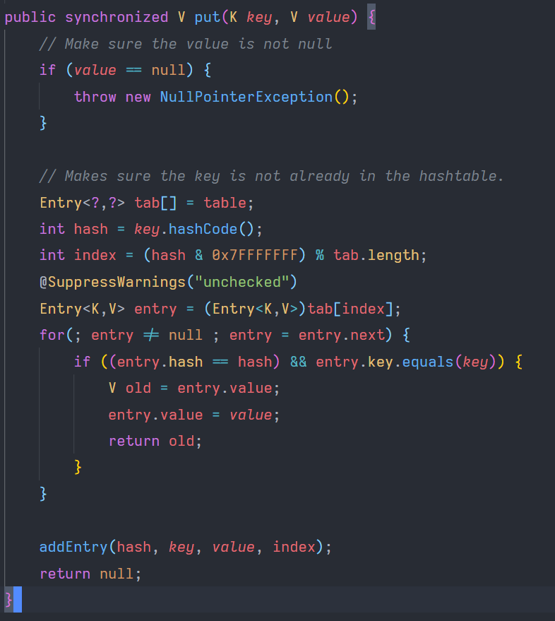

# HashFamily

经典的HASH大家族: Hashtable, HashMap, HashSet.

这三个可太经典了.

没有新手能逃过这3个hash.

HashTable是遗产, 在Java还没有泛型的时候, 就已经有这个东西了, 现在大家都用HashMap. 在任何情况下都不应该用HashTable了, 并且很多的情况下是不需要同步的方法的(synchronizing), 应该使用 transaction 来实现同步.

如果需要同步的HashMap的话, 也用[`Collections.synchronizedMap()`](https://docs.oracle.com/en/java/javase/12/docs/api/java.base/java/util/Collections.html#synchronizedMap(java.util.Map))比较好, 不要用HashTable.

在不需要键值对的情况下使用HashSet, 它和HashTable的算法是一样的, 但是只用来做最基础的集合的用途. 

HashTable特殊的地方, 他的方法中几乎所有都是 `synchronized`, 下面这个就是 `HashTable` 的 put 方法了.

阅读源码真开心!

reference:

https://stackoverflow.com/questions/47838841/hashtable-hashmap-hashset-hash-table-concept-in-java-collection-framework