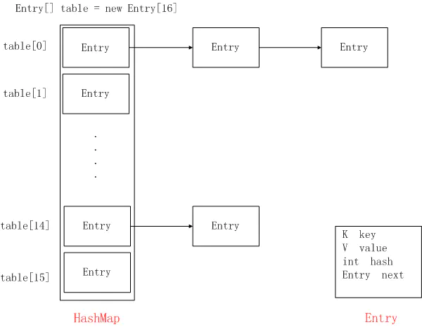

# HashMap

HashMap, 原来学习的时候忘记记了...




这是HashMap中存储的基本元素:

entry代表条目

```java
static class Entry<K,V> implements Map.Entry<K,V> {
	final K key;
    V value;
    Entry<K,V> next;
    int hash;
}
```

