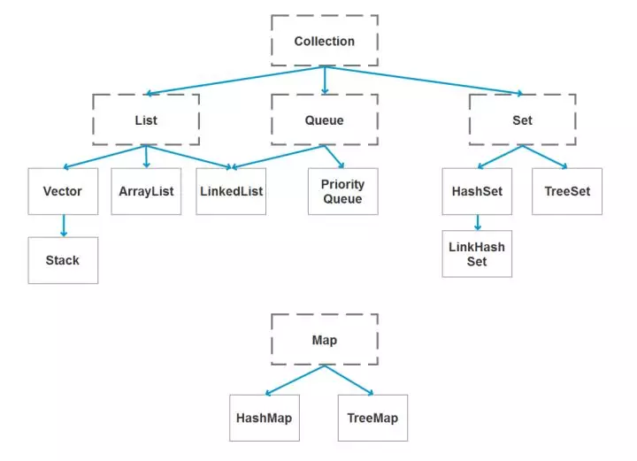
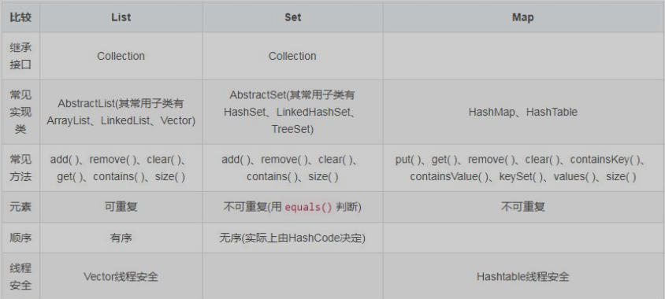

# 常见容器

以下的内容主要以Java描述, 但是在整个行业都应该是一个标准, 所以别的语言其实也都一样. [todo]

1. 下图为Java中常见的容器:

    至于为什么这些数据结构被称之为容器, 我觉得应该是它们能"装"别的东西.
    
    

2. **Collection 和 Collections 有什么区别？**

- java.util.Collection 是一个集合接口（集合类的一个顶级接口）。它提供了对集合对象进行基本操作的通用接口方法。Collection接口在Java 类库中有很多具体的实现。Collection接口的意义是为各种具体的集合提供了最大化的统一操作方式，其直接继承接口有List与Set。
- Collections则是集合类的一个工具类/帮助类，其中提供了一系列静态方法，用于对集合中元素进行排序、搜索以及线程安全等各种操作。

3. List, set, map 之间的区别是什么?
    1. 
