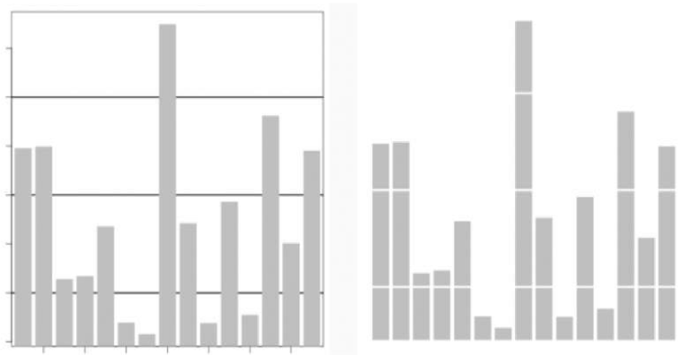
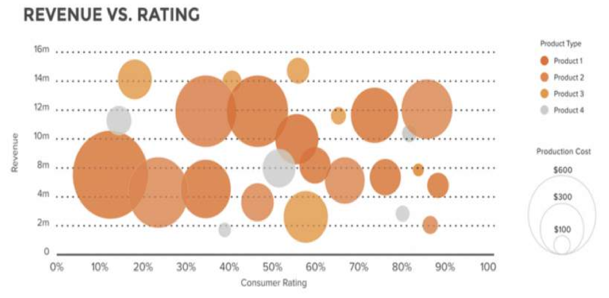
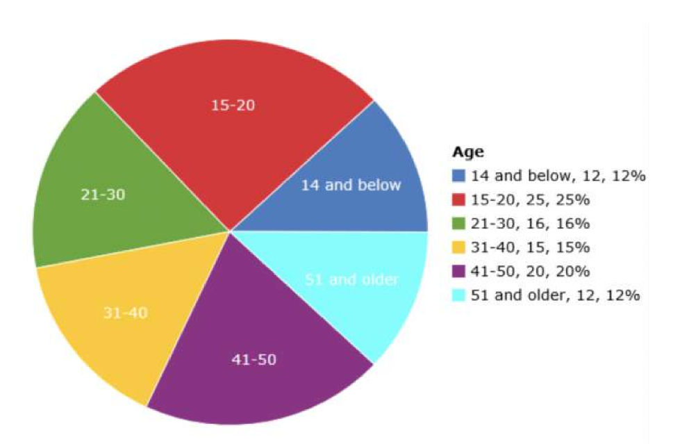
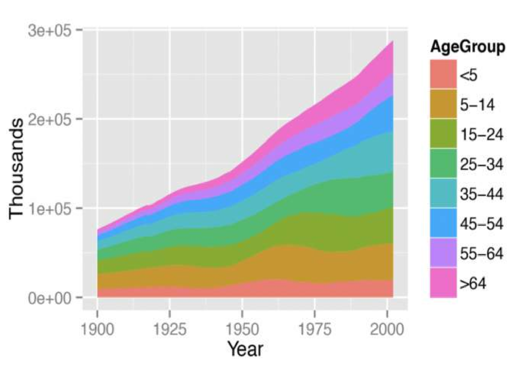
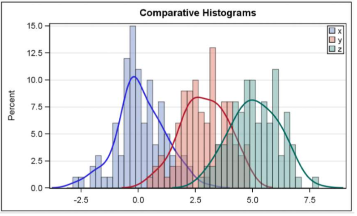
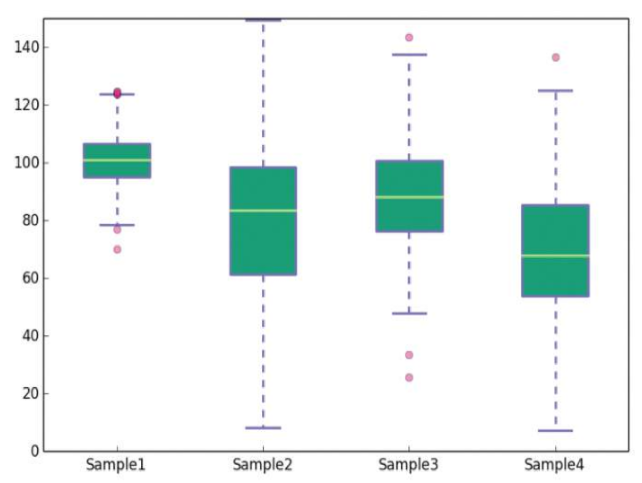

## PRINCIPLES OF VISUALIZATIONS

1. Maximize data to ink ratio: show the data.

   The data should be more compares with the data visualization helper.

   

2. Don’t lie with scale (Lie Factor).

   There should be same unit of scale (Haiwei and XiaoMi).

3. Minimize chart-junk: show data variation, not design variation.

   Visualizaton design is the helper.

4. Clear, detailed and thorough labeling.

> Some basic data visualization guidelines from Edward Tufte

## TYPES OFVISUALIZATIONS

###  Distribution

How a variable or variables in the dataset distribute over a range of possible values.

1. HISTOGRAMS
2. SCATTER PLOTS

### Relationship

How the values of multiple variables in the dataset related. They are used to find correlations, outliers, and clusters in your data.

While the human eye can only appreciate **three dimensions** together, you can visualize additional variables by mapping them to the **size, color or shape** of your data points.

### Composition

How a part of your data compares to the whole. 

1. PIE CHART 

   A pie chart is a way to visualize the static composition (aka, distribution) of a  variable (or singlegroup).

2. stacked area graph

   > 吃了多少黄瓜，吃了多少橘子，吃了多少西瓜，最后叠加起来，吃的越来越多。--sunnary

   

   The effect of these graph is accumulation, sort, trend, value.

### Comparison

How trends in multiple variable or datasets compare.

These are used to compare the magnitude of values to each other and to easily identify the lowest or highest values in the data.

- Bar or column charts: Comparisons among items.
- Line charts: A sense of continuity
- Pie charts for comparison as well

1. MULTIPLE HISTOGRAMS

   

2. BOXPLOTS

   It highlights the range, quartiles, median and any outliers present in a data set.

   

