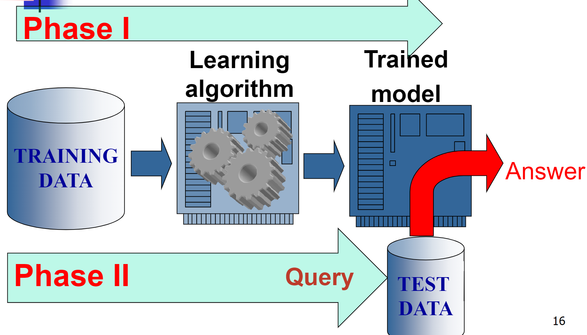
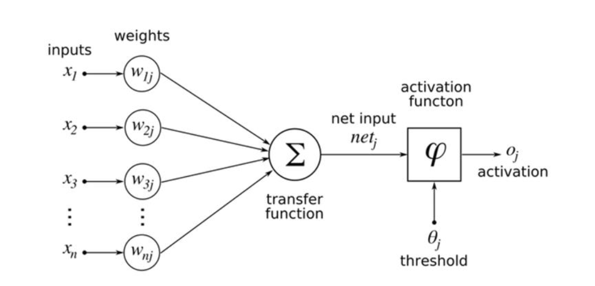
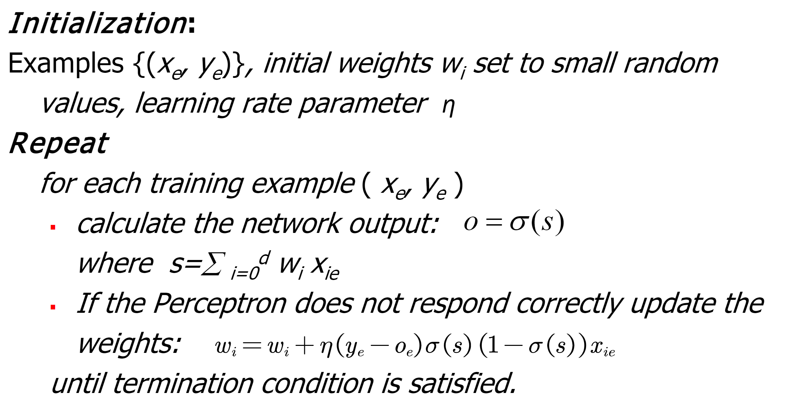
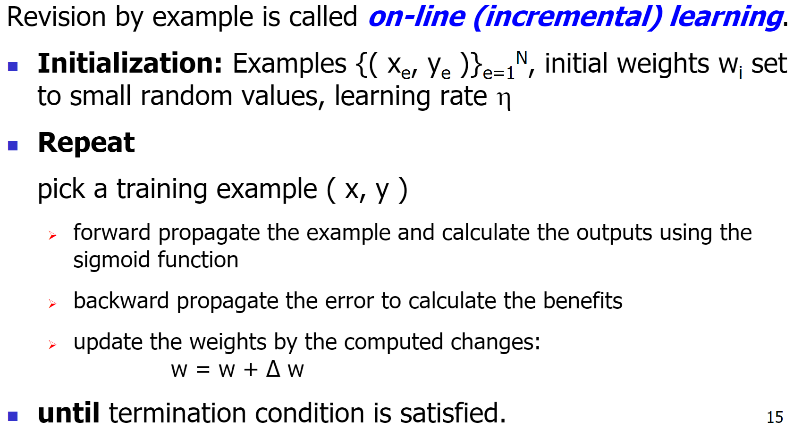
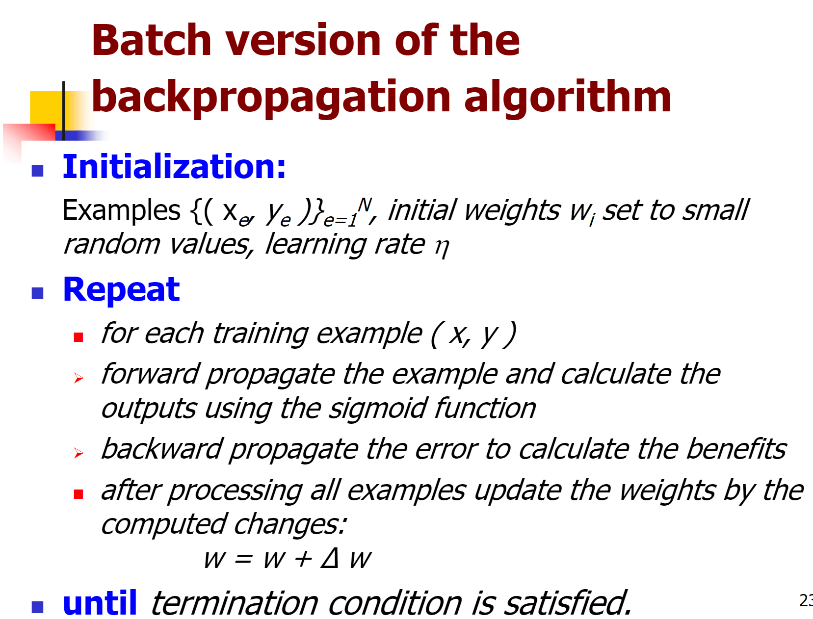

# 从零开始的深度学习

机器学习有两个phase：

1. learning phase
2. application phase

## 感知机 perceptron

它也有别的名字：人工神经元（*ANN*），也叫做*McCulloch-Pitts Neuron*。

多个*input*，一个*output*，但是它的信号只有0和1两种。 

参数列表：

1. *input*：$x_1, x_2$,
2. *output*: $y$,
3. *weight*: $w_1, w_2$,

每一个输入都会被乘上它的权重：$w_1x_1+w_2x_2$

神经元回计算传送过来的信号的总和，当这个总和超过一个阈值(threshold) $\theta$ 时，这个神经元被激活，输出高电平。

这些感知机可以形成**门**电路，通过改变 *weight* 与 $\theta$ 就可以形成不同的**门**。

用 $\theta$ 来进行判断并不符合数学习惯，所以后来演变成了*bias*，在信号总和上加上一个偏置，与0比大小。

$$
\begin{equation}
y =
    \begin{cases}
      0 & (b+w_1x_1+w_2x_2\leq 0)\\
      1 & (b+w_1x_1+w_2x_2\gt 0)\\
    \end{cases}       
\end{equation}
$$

局限性：

单层感知机无法完成复杂任务。比如单层感知机只能表示由一条直线分割的空间。更复杂的任务需要多层感知机。

## 激活函数 activation function

为了使式子（1）变得更加具有普遍性，就需要引入激活函数的概念了，实际上式子（1）的两种0/1情况就是*unit*函数了（阶跃函数）。

于是形成了下面的式子：
$$
y=h(b+w_1x_1+w_2x_2)

\begin{equation}
h(x) =
    \begin{cases}
      0 & (x\leq 0)\\
      1 & (x\gt 0)\\
    \end{cases}       
\end{equation}
$$
$h(x)$就是激活函数。激活函数会将输入信号的总和转换为输出信号。激活函数可以算是神经元的一部分。

激活函数不能是线性函数，因为如果是线性函数的话，它的层数就没有作用了。所以必须是非线性函数。

输出层的激活函数叫做$\sigma()$，不同于隐藏层的$h()$。

## 输出层设计

神经网络可以用于

1. 分类：softmax，每一个输出都与上一层所有的神经元有关。输出的总和是1。在推理阶段会把softmax层省略掉。

2. 回归：恒等函数。隐藏层输出什么就直接输出出来。

   

## 一个完整的神经元

每一个节点都有一个实际的值，每一个连接也都有一个实际的权重。

## 批处理 Batch

每一次输入多个数据，相当于提升了数据的维度。比如一个748的图片（28*28），他的维度就是`(1,748)`。当每次多放进去东西的时候，比如一次放进去100张图片，就变成了`(100,748)`

## 神经网络的学习

几个常见的名词：

1. 数据中学习：可以由数据自动决定权重参数的值。
2. 端到端机器学习（end-to-end machine learning）：从原始数据中获得目标结果。
3. 泛化能力：处理未被观察过的数据的能力。
4. 过拟合（over fitting）：只对一个数据集过度拟合的状态。

用**训练数据**与**测试数据**来进行学习。

1. 使用训练数据进行学习，寻找最优的参数。
2. 用测试数据来评价训练得到的模型的实际能力。

训练数据也被称为监督数据

## 损失函数 Loss function

损失函数是表示神经网络**性能**的恶劣程度的指标，即当前的神经网络对监督数据在多大程度上**不拟合**。

是神经网络找到最优 *weight* 的指标，相当于对这一次的 *weight* 进行打分。

> 以**幸福指数**为指引来寻找最优人生的人一样，神经网络用**损失函数**来寻找权重的最优解。

损失函数直观理解：整个样本集的损失为样本集中每个样本预测值与真实值的误差的平均值（但是有时候会只取一部分）。

在更新参数的时候会对他求导。

整个训练网络的目的是让 Loss Function 最小。

### 均方误差 mean squared error

$$
E=\frac{1}{2}\sum_{k}(y_k-t_k)^2
$$

1. $k$：数据的维数。不能算是严格意义上的维数（ndim），只能说是数据的length。
2. $t_k$：监督数据。
3. $y_k$：神经网络的输出。

用*减法*计算了所有的**神经网络输出**与**监督数据**的相似度。

## Root-Mean-Square (RMS)

$$
R M S=\sqrt{\frac{\sum_{p=0}^{n_{p}} \sum_{j=0}^{n_{o}} e_{j p}^{2}}{n_{p} n_{o}}}
$$

### 交叉熵 cross entropy error

$$
E=-\sum_kt_k\log y_k
$$

参数的意义还是和上面的一样。

$t_k$只在正确解时为1，别的时候是0。所以交叉熵算法只计算了对应**正确解**标签的输出的自然对数。别的输出都不考虑。

## mini-batch

用一部分的样本数据来近似的计算整体。这个里面就是一部分训练数据的损失函数的值。

损失函数的意义就在于，给一个可以求导的评价方式。

## 梯度下降法则

### 数值微分

*数值微分*，用一小段的距离来模拟切线。

通过对损失函数进行梯度下降的方法寻找损失函数的最小值。

在梯度法*gradient method*中，函数的取值从当前位置沿梯度方向前进一定距离，然后在新的位置重新求梯度，再按照新的梯度方向前进。
$$
x_0=x_0-\eta\frac{\part f}{\part x_0}\\
x_1=x_1-\eta\frac{\part f}{\part x_1}
$$
 $\eta$是更新率，也是学习率 *learning rate*。他决定在一次学习中更新多少参数，学习多少。一般会一边学习，一边改变学习率的值 。

$\frac{\part f}{\part x_1}$这个的意思是：当$x_1$变化时，$f$的变化。

那么神经网络的梯度就是：
$$
W=
\left[
\begin{array}{} 

w_{00} & w_{01} & w_{02} \\
w_{10} & w_{11} & w_{12}

\end{array} 
\right]

\\

\frac{\part L}{\part W}=
\left[
\begin{array}{} 

\frac{\part L}{w_{00}} & \frac{\part L}{w_{01}} & \frac{\part L}{w_{02}} \\
\frac{\part L}{w_{10}} & \frac{\part L}{w_{11}} & \frac{\part L}{w_{12}}

\end{array} 
\right]
$$
$\frac{\part L}{w_{00}} $的含义是：当$w_{00}$变化时，损失函数$L$会发生多大的变化。$w_{00}$就是自变量，损失函数是因变量。

SGD *stochastic gradient descent* 随机梯度下降法：意思是对随机选择的数据进行梯度下降法。是随机选择的mini batch数据。

一个epoch的意思是，数据集的每一个数据都看过一遍了。 

## 链式法则

如果某个函数由复合函数表示，则该复合函数的导数可以用构成复合函数的各个函数的导数的乘积表示。
$$
\frac{\part z}{\part x}=\frac{\part z}{\part y}\frac{\part y}{\part x}
$$

把loss function想象成平面，按照平面下降其实还挺害人的。我现在才搞明白。loss function是一个高维的函数，这个函数绝对不可能画出来，因为它有n维（数学上的维度），这个东西也不用傻乎乎的憨憨求导，可以直接用数学上的化简划掉，因为loss function可以完全按照weight简单点来构造。因为就是为了评价weight的好坏。想让loss function下降，按照梯度的定义肯定是没问题的。

## Learning 参数更新

Hebb’s rule
$$
w_{j i}^{k+1}=w_{j i}^{k}+\Delta w_{j i}^{k}\\
\Delta w_{j i}^{k}=C a_{i}^{k} x_{j}^{k}
$$

1. $w_{j i}^{k}$：k时的权重。
2. $w_{j i}{ }^{k+1}$：是下一时刻的权重。
3. $\Delta w_{j j}^{k}$：学习量。
4. $C$：学习率。
5. $a_{i}^{k}$：k时刻的输入。
6. $x_{i}^{k}$：k时刻的输出。

对你没看错，就是输入乘输出。这方法比较蠢，因为会越来越大。

所以之后都是delta rule：
$$
w_{j i}^{k+1}=w_{j i}^{k}+\Delta w_{j i}^{k}\\
\Delta w_{j i}=C e_j x_{j}^{k}
$$
e在这里面是error。用人话来说就是：

`∆w = learning rate x (teacher - output) x input`

然后更新参数。

## Supervised learning process:

two steps：

1. Learning (training): Learn a model using the training data。从数据集里学习出model。

2. Testing: Test the model using unseen test data to assess the model accuracy。从数据集没看过的当作test data。
   $$
   \text{accuracy} = \frac{\text{Number of correct}}		{\text{Total number of test}}
   $$
   
   
   

Supervised learning is mainly applied in classification/prediction.

Repeat

对于每一个training data（输入：x，标签：y），

1. 计算网络的output
   $$
   o_{e}=\sum_{i=0}^{d} w_{i} x_{i e}
   $$
   这应该是一层的所有节点的output。

   

2. 如果网络的loss很高，就update weights。
   $$
   \Delta w_{i}=\Delta w_{i}+\eta\left(y_{e}-o_{e}\right) x_{i e}
   \\
   w_i = w_i + \Delta w_{i}
   $$
   直到loss满足需求。
   
   注意，这里是accumulated error，是要把update weight加起来的。

为啥激活函数不能混着用？

如果激活函数是sigmoid：

$$
\begin{align}{}

w_i &= w_i+ \eta \sum_e(y_e-o_e)\sigma'(S)x_{ie}\\
\sigma ' (S) &= \sigma(S)(1-\sigma(S))\\
\sigma(S) &=\frac{1}{1+e^{-S}}
\end{align}
$$

步骤：

Online learning：

Batch learning

