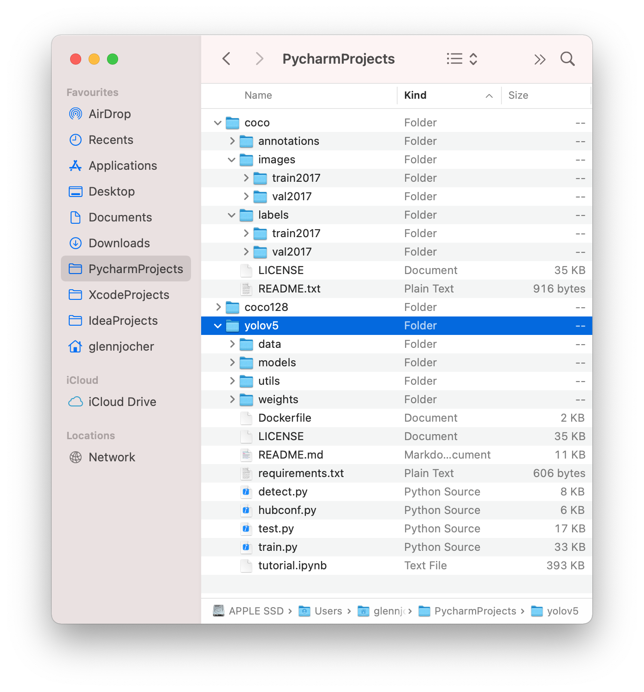

Train

```bash
$ python train.py --data coco.yaml --cfg yolov5s.yaml --weights '' --batch-size 64
                                         yolov5m                                40
                                         yolov5l                                24
                                         yolov5x                                16
                                         
$ python train.py --img 640 --batch 16 --epochs 5 --data coco128.yaml --weights yolov5s.pt

```

Parameter:

1. `--img`:
2. `--batch`:
3. `--data`: image config
4. `--weights`: pretrain `.pt` 


[Official Tutorial](https://github.com/ultralytics/yolov5/wiki/Train-Custom-Data)


The location of data set.

