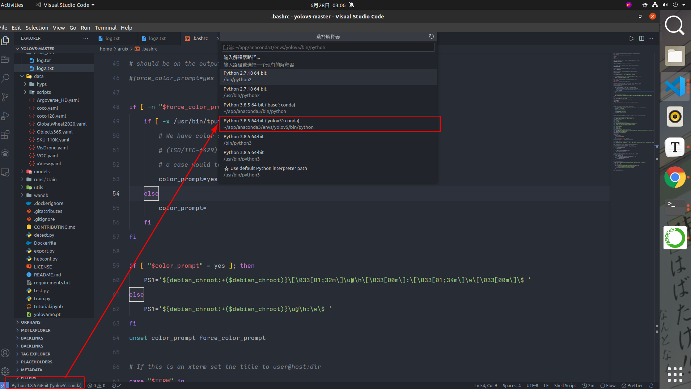

# Anaconda 

Python version and package manger.

```bash
# If you'd prefer that conda's base environment not be activated on startup, set the auto_activate_base parameter to false:
conda config --set auto_activate_base false

# To install conda's shell functions for easier access, first activate
conda init
```


to list all the existed env:

```bash
conda env list
```


activate env

---

```bash
conda activate env_name
```


Choose env in vsode

---

In the vscode, the only thing to choose different env is choosing interpreter:




