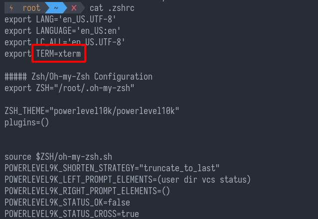

# ZSH


在用docker的时候，`vscode`很贴心的给我配置好的`zsh`，当我还完全没用过的时候。这简直直接让我发现了新世界。

按照中文教程先走了一遍，`term`的字体不合适，会无法显示正常图标，但是在`docker`里面装的就很顺滑，所以尝试一下用别人写好的.sh，装下来是没问题的，但是还是需要有字体。

这个脚本是：

```bash
sh -c "$(wget -O- https://github.com/deluan/zsh-in-docker/releases/download/v1.1.2/zsh-in-docker.sh)"
```


使用的是[powerlevel10k](https://github.com/romkatv/powerlevel10k)这个主题，必须使用有icon的字体，所以需要重新安装字体。值得一提的是，`linux`的字体文件是`/usr/local/share/fonts`，把字体文件放进去就可以了。官方推荐的是`MesloLGS NF`。


官方说的[`nerd-font`](https://github.com/ryanoasis/nerd-fonts#option-1-download-and-install-manually)我并不太明白是怎么用的。并且执行安装的时候会报错:


我好不容易`clone`下来的*github repository*，（需要注意的是，当一个repo太大的时候，需要`shadow copy`，需要加上参数`--depth 1`）

对于这个主题的所有配置是放在`~/.p10k.zsh`的。

可是我按照p10k的configuration怎么调都出不来color bar。结果是xterm的的环境变量不是256color的。下图的话，style就会有问题。这个问题应该是docker安装出来的。




另外，如果tail在下一行的话，是ubuntu的terminal不要随便选里面的参数，我就是乱选了一个参数导致tail换行总错误，tab补全也会经常crash。

