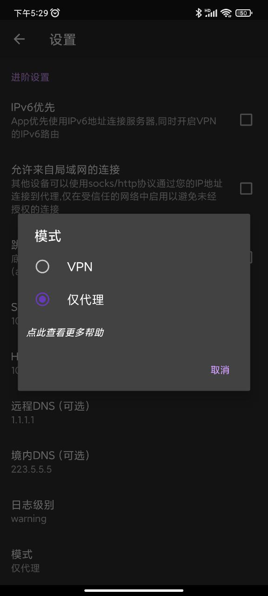

google 是 coder 必须要会的事情,

有任何疑问一定第一件事就是 google.

另外会用 google 是一门必修课,

不是什么奇淫技巧,

就是在需要的时候能记着去用.

并且能用正确的英语提问.

就算是毕业了.

---

在用 google 的第一件事就是外网,

随便 google 了一下,

就看到了这个[一键脚本](<[https://github.com/233boy/v2ray/wiki/V2Ray%E6%90%AD%E5%BB%BA%E8%AF%A6%E7%BB%86%E5%9B%BE%E6%96%87%E6%95%99%E7%A8%8B](https://github.com/233boy/v2ray/wiki/V2Ray搭建详细图文教程)>)

全文用了很长时间来描述如何买搬瓦工.....

人总是要吃饭的嘛, 也是完全可以理解的.

全部的`shell`就只有一句话:

```shell
bash <(curl -s -L https://git.io/v2ray.sh)
```

总共 1k 行, 我准备看一看, 但是`shell`真的不好看懂就是了, 与现在的语法相差还挺大的.

---

github的连接：https://github.com/233boy/v2ray/wiki/V2Ray%E6%90%AD%E5%BB%BA%E8%AF%A6%E7%BB%86%E5%9B%BE%E6%96%87%E6%95%99%E7%A8%8B。

另外要注意的是，服务器的提供商不一定开启哪一个防火墙，可能是ufw也有可能是提供商的控制板中的防火墙，有时候两个都有。


在使用v2rayNG的时候，要注意有些伪装形式下，需要选择模式，具体原理还没有搞清楚，但是有时候换一下就好了。




另外还有一个东西就是，把vmess转化为clash
