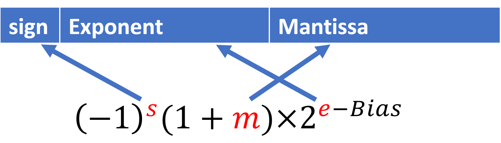
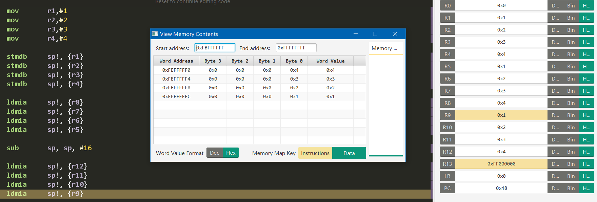

# ARM Instructions


[toc]


<center>
    Aruix
</center>


## Data

### Base

1. 通过进制表示, 以下面的前缀开头:
    1. `0b` Base-2.
    2. `0`or 空 Base-10.
    3. `0x` Base-16.

2. 整数进制转换:

    1. 十进制转OTHER:

        1. 整除法

    2. OTHER转十进制:

        1. 对应位置的次幂: 

            $0b10110 = 2^4+2^2+2^1=22$

3. 浮点数进制转换:

    1. 十进制转OTHER:
        1. 
    2. OTHER转十进制:
        1. $0b101.11=\frac{0b10111}{0b100}=\frac{23}{4}=5.75$
        2. $12.5=\frac{125}{10}=\frac{0b1111101}{0b1010}=0b1100.1$

4. 用IEEE754描述二进制:

    把$12.5$换成*float*:
    $$
    12.5=12+0.5=2^3+2^2+2^{-1}=1100.1=1.1001\times 2^3 \small{(注意这里是base2)}\\
    bias = 127 + power = 130 = 1000,0010\\
    sign = 0\\
    mantissa = 1001(注意在1.1001中, 最前面的1是不算的)
    $$
    

    | sign |      | E    | x    | p    | o    | n    | e    | n    | t    |      | M    | a    | n    | t    | i    | s    | s    | a         |
    | ---- | ---- | ---- | ---- | ---- | ---- | ---- | ---- | ---- | ---- | ---- | ---- | ---- | ---- | ---- | ---- | ---- | ---- | --------- |
    | 0    |      | 1    | 0    | 0    | 0    | 0    | 0    | 1    | 0    |      | 1    | 0    | 0    | 1    | 0    | 0    | 0    | 后面都是0 |

    换成 *base16* 就是: $0\times 41480000$

    

### Two's complement

```
int num;
-num = ~num + 1
```

> *Two's complement* 的运算比直接使用最高位表示符号好做. 直接相加即是答案. 并且靠最高位也依然能看出符号.

用arm写:

```assembly
MVN	r2, r2			;move not取反移动 
ADD	r2, r2, #1		;加1
```


### Floating Point

> 对于这个问题, 已经问过很多次, 但是都没有找到一个能让我满意的答案, 现在在建军的课上我觉得差不多找到了.

浮点数之所以叫做浮点数, 是因为还是有定点数 *fix point*. 他们都是用于表示小数*或者说是分数*, 

1. 定点数: 

    原理就是 *+101101.10010*, 整数部分与小数部分分别表示出来. 组合在一起.

    

    使用的 *int* 与 *long* 就是没有 *fraction* 的形式而已. 负数也是使用 *Two's complement*

2. 浮点数:

    原理: 二进制版的科学计数法.

    之所以叫*浮点数*是因为相对于*定点数*来讲, 他的小数点在哪里是不确定的. 或者说, 不是依靠小数点来确定数值的.

    

     1. Mantissa: 科学计数法的小数部分.

     2. Exponent: 科学计数法的指数部分.

     3. Sign: 符号.

     4. Bias: 指数的偏移值, 因为如果没有偏移值的话, 这个数就太大了, 不能表示很小的部分. 加上偏移值之后, 幂的取值范围也是对半分的了.

        在 32 位浮点数中,  总共是8位的 *exponent* , $bias=2^{8-1}-1=127$ , 所以实际的指数区间是 $[-126, 127]$ .


## Processor Mode

7种进程模式.


一般情况下, 只有 *user* 和 *supervisor* 会被使用到, 在外部的中断下, 比如键盘敲击指令会引起其他模式.

## ARM Registers

- 13 general-purpose registers R0-R12.
- R11: Frame Pointer (FP). 
- R12: 1 Intra-Procedure-call scratch register (IP).
- R13: 1 Stack Pointer (SP).
- R14: 1 Link Register (LR).
- R15: 1 Program Counter (PC).
- 1 Current Program Status Register (CPSR).


### Banked Registers

>  算是被存下来的 *register*. 在比较紧急的 *mode* 下才能使用, 正常的*mode*下是不会使用的.


这些 *register* 的效果是一样的, 只不过在不同的 *mode* 下会使用别的 *register* 以快速应对外部变化. 不需要清空原有寄存器里面的东西.


### CISC & RISC

*RISC* CPU 只能处理在 *registers* 中的数据,  但是 *CISC* 可以直接处理在内存中的数据.

在 *RISC* 中, data必须先从内存中 load 进 register, 在处理过之后, 再 *store* 进内存.


### Thumb Instructions

> 从直觉上来讲, 是简化版的*arm instruction*, 目的是使用更少的内存与更少的 *registers*

7个寄存器与16位处理器.


## Arm instructions

### Syntax 句式


1. *cond:* is an optional condition code.
2. *Rd*: is the destination register. 是存 *result* 的 *register*.
3. *Rn*: is the register holding the first operand.
4. *Operand2*: is a flexible second operand.

> 在 *{}* 中的内容是可以省略的.

这是32位的 CPU, 指令也是32位长的. 64位就是64位长的指令了.


### VALUE 值

---

在汇编里面, 这个叫做立即值 (immediate value)

用 `#` 放在数值前面, 就代表着这个数. 立即数是 `ROR` 产生的, 是有大小限制的.


### OPERATION 运算

---

| Instructions      | Operation      | Meaning                                              |
| ----------------- | -------------- | ---------------------------------------------------- |
| `AND Rd, Rn, op2` | 位运算*和*     | Rd := Rn AND op2                                     |
| `EOR Rd, Rn, op2` | 位运算*异或*   | Rd := Rn XOR op2                                     |
| `ORR Rd, Rn, op2` | 位运算 *或*    | Rd := Rn OR op2                                      |
| `BIC Rd, Rn, op2` | 位运算 CLEAR   | Rd := Rn AND NOT op2                                 |
| `MVN Rd, Rn, op2` | 位运算取反     | Rd := NOT op2                                        |
|                   |                |                                                      |
| `SUB Rd, Rn, op2` | 减法           | Rd := Rn -​ op2                                       |
| `RSB Rd, Rn, op2` | 反向相减       | Rd := op2 - Rn                                       |
| `ADD Rd, Rn, op2` | 相加           | Rd := Rn + op2                                       |
| `ADC Rd, Rn, op2` | 带进位相加     | Rd := Rn + op2 + C                                   |
| `SBC Rd, Rn, op2` | 带进位相减     | Rd := Rn - op2 + C -1                                |
| `RSC Rd, Rn, op2` | 反向带进位相减 | Rd := op2 - Rn + C -1                                |
| `MOV Rd, Rn, op2` | 移动           | Rd := op2                                            |
| `MUL Rd, Rn, op2` | 乘法           | Rd := Rn * op2                                       |
|                   |                |                                                      |
| `LSL Rd, Rm, Rs`  | 逻辑左移       | 直接左移。空位被清除。                               |
| `LSR Rd, Rm, Rs`  | 逻辑右移       | 直接右移。空位被清除。                               |
| `ASR Rd, Rm, Rs`  | 算数右移       | 寄存器内容被视为二进制补码整数。符号位被复制到空位中 |
| `ROR Rd, Rm, Rs`  | 右旋           | 从寄存器的右端移出的位将旋转回左端。                 |
|                   |                |                                                      |

>需要用2进制的位数来思考移动多少位.

### MEMORY 与内存交互

---

| Instructions    | Operation                                                    | Meaning                                                      |
| --------------- | ------------------------------------------------------------ | ------------------------------------------------------------ |
| `DCD`           | 在内存中声明 *WORDs*, 每一个*element* 都放在一个 *WORD* 里面. | `my_numbers DCD 7, 8, -11, -12, 9, 0, 1, 12, 5, -6`          |
| `EQU`           | 在内存中声明一个常量                                         | `my_const EQU 0x12344321`, define a const                    |
| `FILL`          | 在内存中声明**空的** *WORD*                                  | `my_data FILL 16`, 声明 4 个 word space                      |
|                 |                                                              |                                                              |
| `LDR Rd, [Rn]`  | 从内存中读取                                                 | 从 *Rn* 中得到的值当成指针, 把指针指向的内存里的值放进 *Rd*. |
| `STR Rd, [Rn]`  | 把值存在内存中                                               | 把 *Rd* 中的值存在 *Rn* 显示的内存地址中.                    |
| `MOV Rd, Rn`    | 把 *Rn* 里的东西直接放到 *Rd* 中.                            |                                                              |
| `ADR r3, label` | 读取*label*                                                  | 把label的内存地址放在r3中, 或者是label所代表的常数           |

> ***[Rn]*** 是间接取地址的的符号, 也就是把 *Rn* 中存的值当成指针, 取出指针所指的东西.
>
> 
>
> `STR`与`LDR`的记忆方式: `str/ldr value, [memory]`
>
> `dcd` 里面放的是不带`#`的. 不是立即数


> 与内存交互的时候, 都是把变量名写在 `operation` 的前面, `dcd`, `equ`, `fill` 都是的.


***例子:***

| R6   | R11          | 0x00004000   |
| ---- | ------------ | ------------ |
|      | *0x00004000* | *0xF97D5EC5* |

***LDR r6, [r11]***

| R6           | R11          | 0x00004000   |
| ------------ | ------------ | ------------ |
| *0xF97D5EC5* | *0x00004000* | *0xF97D5EC5* |


**equ**的例子

```assembly
var1		equ		1
			ldr		r1, =var1 ;这是伪指令, 可以直接把equ的值取出来.
```


**dcd+adr+ldr**例子

```assembly
array	dcd		1,2,3,4,5,6,7
		adr		r0, array	;先拿到地址, 放到寄存器里
		ldr		r1, [r0]	;再根据偏移量取值
```

必须要先拿到 *label* 的地址, 放到寄存器里, 才能从内存里面取值. 不然都不知道取哪里的值.


### OFFSET 偏移

---

| Instructions          | Operation | Meaning                                                      |
| --------------------- | --------- | ------------------------------------------------------------ |
| `LDR r6, [r11, #12]`  | pre load  | 取出r11后面12bits的内存中的值, *r11没变* (不发生*回写*).     |
| `LDR r6, [r11, #12]!` | pre load  | 先r11加上12, 之后取出r11内存中的值, *r11变了 (回写)*.        |
| `LDR r6, [r11], #12`  | post load | 先取出r11内存中的值, 后r11加上12, *r11也是会变的*, 在post里面, 回写总是发生 |

> 如果是 `LDRB` 就是以 bytes 为单位. 就不用以 4 为基准, 别的要以4为倍数, 因为 *1 word = 4 Bytes* 是一个存储单元的标准.

> ***!*** 
>
> 回写, 是会改变 register 的值, 让register在运算之后更新.专有名词叫做 "Register write-back".
>
> ```assembly
> LDP X8, X2, [X0, #0x10]!
> ```
>
> `X0` modified so that after the operation:
>
> ```assembly
> X0 = X0 + 0x10
> ```
>
> If you do not put the `!`, `X0` is not modified by the operation.
>
> 但是在 post load 的情况下, 回写是总是发生的.

>**记忆方法**:
>
>用 ***[ ]*** 括在一起的就是 pre load, 代表他们的运算先发生.
>
>运算数写在 ***[ ]*** 外面的就是之后才进行操作的. 


例子:

*preload*发生回写

```assembly
array	dcd		1,2,3,4,5,6,7
		
		adr		r0, array
		ldr		r1, [r0]
		ldr		r2, [r0, #4]!
		ldr		r3, [r0, #4]!
		ldr		r4, [r0, #4]!
		ldr		r5, [r0, #4]!
```


*preload* 不发生回写

```assembly
array	dcd		1,2,3,4,5,6,7
		
		adr		r0, array
		ldr		r1, [r0]
		ldr		r2, [r0, #4]
		ldr		r3, [r0, #8]
		ldr		r4, [r0, #12]
		ldr		r5, [r0, #16]		
```


*post load* 一定回写

```assembly
array	dcd		1,2,3,4,5,6,7
		
		adr		r0, array
		ldr		r1, [r0], #4
		ldr		r2, [r0], #4
		ldr		r3, [r0], #4
		ldr		r4, [r0], #4
		ldr		r5, [r0], #4
```


`adr`是在内存中声明过变量之后一定要用的指令. 代表它的地址是什么. `ldr`就是直接从整个地方取东西了.


### LITTLE OR BIG ENDIAN 大小端

---

人类的读写方式是小端, 反过来的是大端.


### FLAGS 

---

| FLAG | Meaning  | PS   |
| ---- | -------- | ---- |
| Z    | Zero     |      |
| N    | Negative |      |
| C    | Carry    |      |
| V    | Overflow |      |

- 后面有 *s* 的表示这个 *operation* 需要引起 *flag* 的变化, 不然一般情况下不会有 *flag* 的变化.

- *flag* 会保持到下一个 *s-suffix* 执行.

- 另一些指令例如 `CMP` 也会 *set flag*. 
    - 用 rd 与 rn 相减;
    - 负数: N -> 1;
    - 零: Z -> 1;
    - 溢出: V -> 1;
    - 进位:  C -> 1;


***例子:***

1. `0xffffffff - 0x00000001 -> N and C` 在汇编中没有减法, 都是把数做 *2's implement* 之后相加的, 所以相当于是 `-1 + (-1) = 0xffffffff + 0xffffffff`, 所以既是负数又是进位.


### CONDITIONAL BEANCH 条件支路

---

| Instructions  | Operation           | Meaning                        | PS                                        |
| ------------- | ------------------- | ------------------------------ | ----------------------------------------- |
| B{cond} label | 导向 label 支路     | 无条件直接跳转                 |                                           |
| BNE           | Branch not equal    | 当 flag Z == 0 的之后会跳转    |                                           |
| BEQ           | Branch equal        | 当 flag Z == 1 的之后会跳转    |                                           |
| BL            | Branch with Link    | 把跳转点位置存在 *R14 (LR)* 中 | 可通过在子程序的尾部添加`mov pc, lr` 返回 |
| BX            | Branch and Exchange |                                |                                           |

Branch-mnemonics: 是每一个branch的label, 当条件符合的时候就会自动跳转到这个label上来.

下面是 *conditions*


### SUBROUTINE 子程序

---

`r14`可以被写为`lr` *link register*, 是一种简便的记忆方法, 是存放跳转地址 *return address* 的.

为了从子程序中跳出, 或者说从子程序中到主程序中, 用 `MOV pc, lr`, 全拼就是 `MOV r15, r14`

但是要是从一个子程序跳转到另一个子程序的时候就会有问题.


**NESTING 嵌套**

子程序内还有另一个子程序.

这种时候就不能只用 `lr` , 因为 `lr` 里面只能放一个. 所以就要用到 *栈*.

栈顶指针就是指向栈顶的.


### STACK 栈

---

Stack Classification

1. Based on the direction of stack growth, *Ascending and descending stacks 升序栈与降序栈*:

   1. Ascending Stack -When items are pushed on to the stack, the stack pointer is increasing. That means the stack grows towards higher address. 栈顶的位置大 -> 升序 ascending
   2. Descending Stack -When items are pushed on to the stack, the stack pointer is decreasing. That means the stack is growing towards lower address. 栈顶的位置小 -> 降序 descanting. This type stack is often used.

2. Based on where the stack pointer points to:

   1. Empty Stack -Stack pointer points to the location in which the next/first item will be stored. e.g. A push will store the value, and increment the stack pointer for an Ascending Stack. 

      > this means the stack pointer points the position has no thing 

   2. Full Stack -Stack pointer points to the location in which the last item was stored. e.g. A pop will decrement the stack pointer and pull the value for an Ascending Stack.

      > this means the stack pointer points the position has thing 


在 *ARM7* 中两种都可以, 但是不要从一种转化成另一种.

栈顶指针叫做 `r13`, 或者是小名 `sp` *stack pointer*

```assembly
; To push the link register value onto a full descending stack
; 把 link register 记录的位置放到栈顶
STMFD sp!, {lr}
; To pop a value from a full descending stack back into the link register
; 把栈顶记录的地址放到 link register 中
LDMFD sp!, {lr}
```


在一般情况下, 子程序的第一个指令就是:

```assembly
; 把返回主程序的地址放到栈顶. 之后就能调用别的程序了.
STMFD sp!, {lr}
```

从这个子程序中*return*

```assembly
; LDMFD sp!, {lr}
; MOV pc, lr
LDMFD sp!, {pc}
```


**Push and Pop**

---

| Instructions                          | Operation    | Meaning        |
| ------------------------------------- | ------------ | -------------- |
| `STM{addr_mode}{cond} Rn{!}, reglist` | general push |                |
| `LDM{addr_mode}{cond} Rn{!}, reglist` | general pop  |                |
|                                       |              |                |
| `LDMIA sp!, reglist`                  | POP          | 是最常用的出栈 |
| `STMDB sp!, reglist`                  | PUSH         | 是最常用的压栈 |
|                                       |              |                |

***addr_mode*** can be: 

1. `IA` Increment address After each transfer 
2. `IB` Increment address Before each transfer 
3. `DA` Decrement address After each transfer 
4. `DB` Decrement address Before each transfer.

`{!}` if ! is present, the final address is written back into Rn.

`reglist` is a list of one or more registers to be loaded/saved


```assembly
		mov		r0, #1
		mov		r1, #2
		mov		r2, #3
		mov		r3, #4
		stmdb	sp!, {r0, r1, r2, r3}; 
		;		same as the 5 lines below
		;sub		sp, sp, #16
		;str		r0, [sp]
		;str		r1, [sp, #4]
		;str		r2, [sp, #8]
		;str		r3, [sp, #12]
		
		stmda	sp!, {r0, r1, r2, r3}
		;		same as the 5 lines below
		;str		r3, [sp]
		;str		r2, [sp, #-4]
		;str		r1, [sp, #-8]
		;str		r0, [sp, #-12]
		;sub		sp, sp, #16
```


从内存的最高位开始 push into stack, 从内存的最低位开始存 instructions.




### Tools-Chain

----

是把每一个小工具都通过管道连起来了, 在 *linux* 上的工具链都有不同的名字, base它的发行版. 

[Reference](https://www.rapidtables.com/code/linux/gcc/gcc-o.html)

