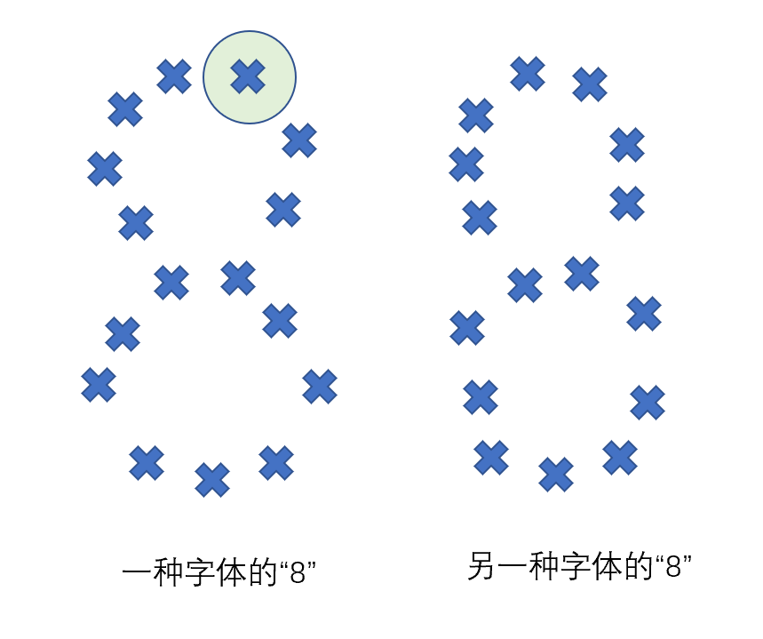

# 猫眼电影字体识别

[TL, DR](#只要到达那个地方)

每一个电影的详情页的字体都是猫眼特殊生成的。每次刷新之后的字体文件都是不一样的。

给一个高清大图，这扭曲的不仅是字体，还是人性：


歪几把扭不是我截图的问题，这个是猫眼特殊生成的字体。因为比较小，所以在普通的页面上是看不出这样的奇效的。

打开F12看一眼原理，


对应位置是乱码，但是看到有CSS的`stonefont`类，再去看一眼。


顺着url下载，就是对应的`woff`字体文件。

在[字体平台](https://kekee000.github.io/fonteditor/index.html)上打开刚刚下载好的字体文件：


数字0-9都是随机生成的字体，放在随机的unicode的位置上。比如上图的“8”就是占用了`uniF7A6`这个位置，放的是“8”的字形。

把这个字放大，照亮全部的细节：


小的圆点是弯曲程度，方点是这一个“笔画”的起始点。红色和蓝色的方点是整个笔画起始点。一个字体可以有很多个笔划，比如这个8就是三个笔划写出来的。整个字体的显示过程，是有一个虚拟的笔，把每一个笔划从起点画到终点。

```python
# 设置一个字体
font_base = TTFont("./font/iconfont0.woff")

# 拿出某一个字符的所有的坐标点
font_base["glyf"]["uniE83C"].coordinates

# output
GlyphCoordinates([(374, -26),(292, -37),(288, 538),(264, 526),(219, 486),(153, 444),(112, 423),(100, 520),(186, 561),(256, 612),(274, 637),(299, 652),(324, 702),(382, 702),(374, -20)])

```


字体是用笔迹画出来的 [1]：

```python
from fontTools.pens.recordingPen import RecordingPen
glyph = font.getGlyphSet()['a']
p = RecordingPen()
glyph.draw(p)
p.value

# output:

[('moveTo', ((288, 545),)),
 ('qCurveTo', ((386, 545), (480, 459), (480, 365))),
 ('lineTo', ((480, 0),)),
 ('lineTo', ((416, 0),)),
 ('lineTo', ((399, 76),)),
 ('lineTo', ((395, 76),)),
 ('qCurveTo', ((360, 32), (282, -10), (215, -10))),
 ('qCurveTo', ((142, -10), (46, 67), (46, 149))),
 ('qCurveTo', ((46, 229), (172, 316), (303, 320))),
 ('lineTo', ((394, 323),)),
 ('lineTo', ((394, 355),)),
 ('qCurveTo', ((394, 422), (336, 474), (283, 474))),
 ('qCurveTo', ((241, 474), (165, 449), (132, 433))),
 ('lineTo', ((105, 499),)),
 ('qCurveTo', ((140, 518), (236, 545), (288, 545))),
 ('closePath', ()),
 ('moveTo', ((393, 262),)),
 ('lineTo', ((314, 259),)),
 ('qCurveTo', ((214, 255), (137, 199), (137, 148))),
 ('qCurveTo', ((137, 103), (192, 61), (235, 61))),
 ('qCurveTo', ((302, 61), (393, 136), (393, 214))),
 ('closePath', ())]

```

所以最先想到的解决方法，是字体做笔划比对。

比如，我用眼睛看出来一套字体0-9的10个数字，也知道了它的所有笔划，那么再拿过来一个新的字体的时候，我把新字体与0-9都做笔划比对，要是其中的一个字体的笔划与未知字体的笔划重合度高，那么就应该是这个字体了。

思路清晰了，implementation如下（代码不完整，完整代码比较长，这里只分析逻辑）：

```python
def char2num(new_code: str):
    # 从网页上拿来的unicode编号和字体中的略有不一样，所以需要转化一下。
    new_code = "uni" + new_code.encode("unicode_escape").decode()[-4:].upper()
    # 拿到字体的笔划表
    glyph = font_new.getGlyphSet()[new_code]
    # 那个画字体的笔
    p = RecordingPen()
    # 开画！
    glyph.draw(p)
    # 所有笔划放进一个set里，方便做比对
    s = set(p.value)
    # one hot 数组，数组里最大的值的index，就是这个数字本身了。
    one_hot = []
    # font_base_draw_list是人工识别下来的10个数字字体表。
    for i in font_base_draw_list:
        # 把对比的两个字体的set的相交笔划数放到数组里
        one_hot.append(len(s.intersection(i)))
		# 相交数最多的index就是这个数字了。
        return one_hot.index(max(one_hot))

```


但是一套代码实现下来，发现经常会有与这个字体只相交了一个笔划的情况。也就是说`onehot`数组里都是1。效果不够好。


思来想去，感觉笔划的信息太多，不好计算，动作信息用处不大，并且字体的起始笔划是会变动的，正着画，反着画对字形没有影响，但是比对。字体稍微有一点点变化，就难以判定这是同一个笔划。所以决定用字体的位置点：*coordinate*。coordinate是list of tuple，每一个tuple都是x和y坐标。这样比较好计算。

所以比较直接的办法，就是对坐标list计算距离。两个同样的字，即使是字体不同，那么每一个点的距离应该也会比较近。

例如（只是举个例子，这个8应该是两圈点，偷懒只画了一圈）：


那么每一个坐标点，距离它不同字体的**最近坐标**点的距离之和，应该是最小的。还是像刚刚的思路一样，放进*one-hot* list，找到最小的index就是这个数字了。

并且在不同字体中同一个字的坐标个数不一样，但是也不会有太大的浮动。首先排除掉坐标个数差别大的，下面的代码中写的是8个为基准，相差多过8个就认为不是这个字，就跳过。

```python

def _base_number_to_code(x):
    return {
        1: "uniE83C",
        2: "uniEA5E",
        3: "uniF6D1",
        4: "uniF882",
        5: "uniE39D",
        6: "uniF139",
        7: "uniF223",
        8: "uniF7A6",
        9: "uniEBF7",
        0: "uniF1C0"
    }[x]

def char2num(new_code: str):
    new_code = "uni" + new_code.encode("unicode_escape").decode()[-4:].upper()
    coordinates_new = sorted(list(font_new["glyf"][new_code].coordinates))
    one_hot = []
    for i in range(0, 10):
        coordinates_base = font_base["glyf"][_base_number_to_code(
            i)].coordinates
        one_hot.append(_relative_distance(
            coordinates_new, coordinates_base))

   	return one_hot.index(max(one_hot))


# l0 和 l1 是两个字体的坐标点list
def _relative_distance(l0, l1):
    """use every point distance to check number which is best

        Args:
            l0 (list): base font points list
            l1 (list): new font points list

        Returns:
            distance: \sigma every point distance
    """
    if abs(len(l0) - len(l1)) > 9:
        return float("inf")
    dis = 0
    for i0, i1 in zip(l0, l1):
        dis += math.sqrt((i0[0]-i1[0])**2 + (i0[1]-i1[1])**2)
        return dis
```

> 这个实现的有点问题，在写文的时候才发现的。“那么每一个坐标点，距离它不同字体的**最近坐标**点的距离之和，应该是最小的”，在这个代码中的最近坐标点我只用了`sort`对`x`坐标排了序，对`y`坐标没有计算。所以并不是距离它最近的点。
>
> 正确的方法应是$O(n^3)$的，算出新字体所有点 和 每一个已知字体的点的距离，拿出来最小的那个，累加在one-hot值上面，one-hot中最小的那个应该就是对应的字形。
>
> 但是下面说的方法和这个比较像，所以我就不再改这个了hahaha。

实现完成之后，感觉效果已经好了一些（即使是实现的有问题），但是还会分不清“8”和“0”。

###### 只要到达那个地方

所以我又想了一个办法。

这个问题的最大难点就是坐标点是飘动的。但是由于要让人能看出来这是啥字，就不能飘太狠。所以每一个坐标点的飘动会在一个阈（fá）值内。那么，把两个字放在同一个坐标系中，记录一个字和另一个字的坐标点在某个范围内的个数，个数越多，证明两个字形越像。



为了找到最好的阈（fá）值，我算了一下不同字体的相同字的平均距离，是6.75。

```python
def find_avg_of_min_dis_of_point():
    ms = []
    for dd in d:
        # the mininum distance of dd
        m = float("inf")
        for ll in l:
            # Find the nearest point
            r = math.sqrt((dd[0]-ll[0])**2 + (dd[1]-ll[1])**2)
            m = r if r < m else m
            if r == 0:
                break
        ms.append(m)
        print(m)

    print("avg: ", np.average(np.array(ms)))
```

那么我觉得距离为10应该差不多吧。


再次实现一遍：

```python
# l 和 d 都是list of coordinates
# 算出来每一个点在一个范围内的另一个字体的点的数量（？已经不会说话了，人类语言有点难超过O(n^3)的复杂度）
def _max_points_in_region(l, d):
    n = 0
    for dd in d:
        for ll in l:
            # Find the nearest point
            r = math.sqrt((dd[0]-ll[0])**2 + (dd[1]-ll[1])**2)
            if r <= 10:
                n += 1
                l.remove(ll)
                break
    # Accuracy
    p = n / len(d)
    logger.debug(f"正确率：{p*100}%")
    return p

def _base_number_to_code(x):
    return {
        1: "uniE83C",
        2: "uniEA5E",
        3: "uniF6D1",
        4: "uniF882",
        5: "uniE39D",
        6: "uniF139",
        7: "uniF223",
        8: "uniF7A6",
        9: "uniEBF7",
        0: "uniF1C0"
    }[x]

def char2num(new_code: str):
    new_code = "uni" + new_code.encode("unicode_escape").decode()[-4:].upper()
    coordinates_new = list(font_new["glyf"][new_code].coordinates)
    one_hot = []
    for i in range(0, 10):
        coordinates_base = font_base["glyf"][_base_number_to_code(i)].coordinates
        one_hot.append(_max_points_in_region(coordinates_new, coordinates_base))

    return one_hot.index(max(one_hot))
```

这种算法的识别率就完美了。

露一手：


说实话要是再不行就准备用深度学习了，计算机科学家永不认输hhh。还好到此为止了。


Reference:

[1] 很好的`TTFont`入门：https://github.com/lynneyun/Tutorials/blob/6cabd407054431559b30d66d9b664462bb1d58b7/FontTools%20%26%20DrawBot/Navigating%20TTFs%20with%20fontTools.ipynb