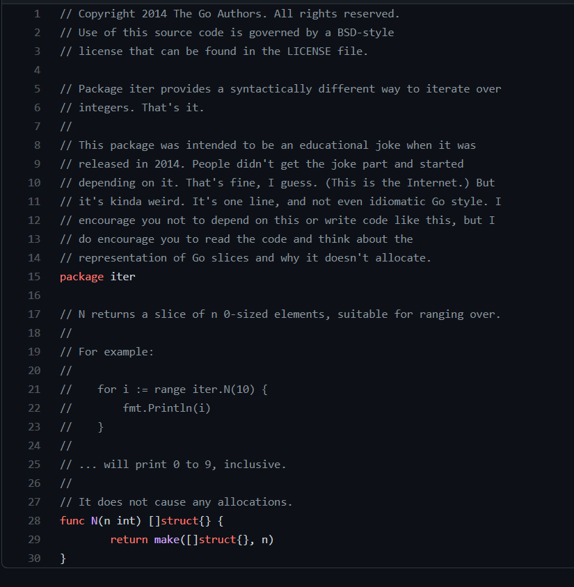

# for range


### 指针问题

题目是 for range , 但其实我想写的首先是指针的问题.


```go
x := make([]int, 3)

x[0], x[1], x[2] = 1, 2, 3

for i, val := range x {
    println(&x[i], "vs.", &val)
}

//output:
----------------------------------
0xf84000f010 vs. 0x7f095ed0bf68
0xf84000f014 vs. 0x7f095ed0bf68
0xf84000f018 vs. 0x7f095ed0bf68
```


for range 遍历出来的东西并不能是指针, 而是一个值.


一个值代表的是: 他是一个独立的变量, 对于它的改变并不会影响到原来的值.

而指针意味着: 这就是这个变量, 对他的改变就是对原来的变量进行的改变.


### 对数字进行遍历

python 就有对数字进行遍历的, 也是for range写法, golang也有相似的写法:

```go
for i := range iter.N(4) {
    fmt.Println(i)
}
```

但是我刚刚看了以下这个包, 并不是golang的startard库, 并且作者说这样写很不golang. 也最好不要这么用.

以下是源码:



比较有意思的是: 空对象(`struct{}`)是不占有内存空间的, 即使是很多个 (不过我在想, 如果它不占空间的话, 是怎么能知道这个`[]struct{}`里面有多少东西的呢?). 

一个空的`[]struct{}`大小是24B,

一个空的`struct{}`大小是0, 因为它没有字段(fields), 所以不需要空间.

一个空的`struct{}`地址是`&{}`, 因为没有东西, 所以不需要分配内存地址 (也就是说, 它甚至都不存在)


reference: 

[1] 关于对数字进行遍历的讨论. 很 stackoverflow 的讨论, 没有膜拜大神, 没有人身攻击: https://stackoverflow.com/questions/21950244/is-there-a-way-to-iterate-over-a-range-of-integers

[2] 关于空对象内存的讨论. https://stackoverflow.com/questions/48052722/addresses-of-slices-of-empty-structs

[3] The deeper empty struct: https://dave.cheney.net/2014/03/25/the-empty-struct

[4] 在for range循环中获得指针: https://stackoverflow.com/questions/15945030/change-values-while-iterating