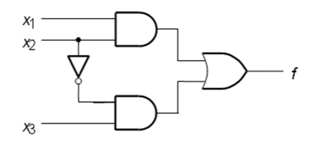
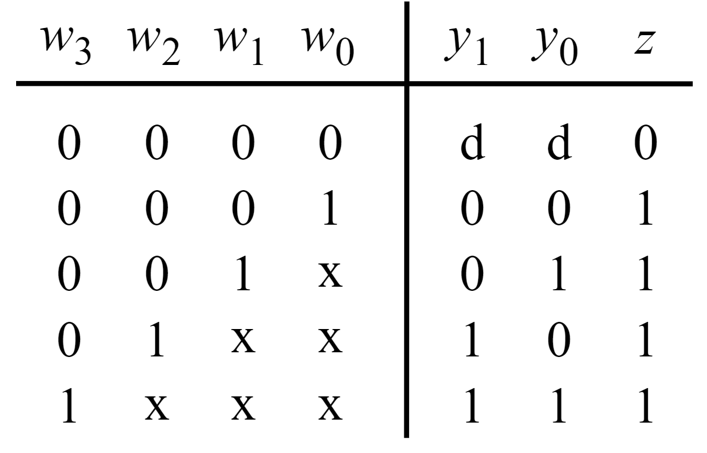
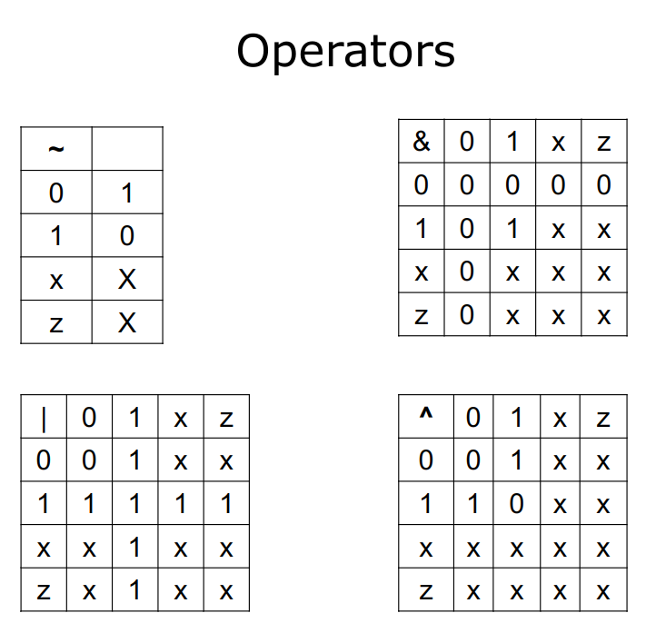

# Verilog

[toc]


### Term

1. Module: class in Java. The unit to complete all part of work. It can include subcircuit (it can be build up by other parts of modules).
2. Port: it refers to an input or output connection in a circuit. 

## Module

```verilog
module module_name(port_name_0, port_name_1, ...);
    // module_port_declarations
    
    module_items
    
endmodule 

```

### Port

The IO interface of the *Module*. As the parameters list of *Module*

When the Module be instantiated, the port should be connected.

There are two ways to connect ports:

1. Port order connections.

   ```verilog
   module_name instance_name(signal_0, signal_1)
   ```

   like the common pass the arguments in Java or C++.

2. Port name connections.

   ```verilog
   module_name instance_name(.port_name_0(signal_0), .port_name_1(signal_1))
   ```

   Like the Python pass the arguments. The arguments name can be specified.

   ```python
   add( param1=1, param2=2 )
   ```


### Parameters redefinition

Reassign a value to the *Port* of *Module*.

Two ways:

```verilog
module_name instance_name (signal, signal, ...);

// Explicit
defparam instance_name.parameter_name = value;


// implicit
module_name #(value) instance_name (signals); // base on the same order of the module.
```


### Generate Construct

```verilog
module ripple_g (carryin, X, Y, S, carryout);
  parameter n = 4; 
  input carryin; 
  input [n-1:0] X, Y; 
  output [n-1:0] S; 
  output carryout; 
  wire [n:0] C; 
 
  genvar i; 
  assign C[0] = carryin; 
  assign carryout = C[n]; 
 
   generate
    for (i = 0; i <= n-1; i = i+1) 
    begin:addbit 
      fulladd stage (C[i], X[i], Y[i], S[i], C[i+1]);
    end 
  endgenerate
 
 endmodule
```

Each instance named `addbit[i].stage`. Because the 16 line named `stage` and the *Module* named fulladd.


### Primitive Instantiations

These are the fundamental gates, such as add, or gates. They are prepared in Verilog. Such as the `int`, `boolean` types of Java.

Here are to ways to define them.

```veri
gate_type [instance_name] (output_port, input_port);
gate_type # (delay) [instance_name] (output_port, input_port );
```

1. gate_type: the type of gate
2. Instance_name: optional.
3. delay: propagation delay in time units.
   1. If no delays are defined, the default delays are 0.
   2. If only one delay is defined, it is for all.
   3. If two delays are defined, they are rise and fall delays.
   4. If three delays are defined, they are rise, fall and turn-off delays, which can only be used for buffers.
   5. Examples: 
      1. and #(2) o1 (out1, a, b);
      2. and #(2, 3) o2 (out2, a, b);
      3. bufif0 #(5, 6, 7) o3 (out3, a, b);


The table contains all types of primitive instantiations.


`notif` and `bufif` gates are tri-state buffers. 


## Function

A function is a part of the code that may be re-used and thus separated from the other parts in a module

Syntax:

```verilog
function [ size_or_type ] function_name;
    input declarations
    local variable declarations
    procedural statements
endfunction
```

1. `size_or_type` (optional) is the returned type or range as [msb:lsb]. The default is a 1-bit value.
2. Functions should have at least one input.
3. The function name serves as the only output variable. **No other** output or inout is allowed.
4. Functions are only defined within a module

> The function of *verilog* if much different away from standard function in many Program language. Only one output and cannot use at other module. 

Example:  16-to-1 multiplexer


```verilog
module mux_f (W, S16, f);
    input [0:15] W;
    input [3:0] S16;
    output reg f;
    reg [0:3] M;

    function mux4to1;
        input [0:3] W;
        input [1:0] S;

        if (S = = 0) mux4to1 = W[0];
        else if (S = = 1) mux4to1 = W[1];
        else if (S = = 2) mux4to1 = W[2];
        else if (S = = 3) mux4to1 = W[3];
    endfunction

    always @(W, S16)
        begin
            M[0] = mux4to1(W[0:3], S16[1:0]);
            M[1] = mux4to1(W[4:7], S16[1:0]);
            M[2] = mux4to1(W[8:11], S16[1:0]);
            M[3] = mux4to1(W[12:15], S16[1:0]);
            f = mux4to1(M[0:3], S16[3:2]);
        end 

endmodule
```


## Task

1. A task is a part of the code that may be re-used and thus separated from the other parts in a module.
2. A task may have any number of inputs, outputs or inouts. 
3. A task does not return any value by its name. 
4. A task is like a subroutine(子程序 in C).


Example: a 16-to-1 multiplexer


```verilog
module mux_t (W, S16, f);
    input [0:15] W;
    input [3:0] S16;
    output reg f;
    reg [0:3] M;

    task mux4to1;
        input [0:3] W;
        input [1:0] S;
        output Result;
        begin
            if (S = = 0) Result = W[0];
            else if (S = = 1) Result = W[1];
            else if (S = = 2) Result = W[2];
            else if (S = = 3) Result = W[3];
        end
    endtask

    always @(W, S16)
        begin
            mux4to1(W[0:3], S16[1:0], M[0]);
            mux4to1(W[4:7], S16[1:0], M[1]);
            mux4to1(W[8:11], S16[1:0], M[2]);
            mux4to1(W[12:15], S16[1:0], M[3]);
            mux4to1(M[0:3], S16[3:2], f);
        end 

endmodule

```


## Circuits

### Base Gates

The gate instantiation statements ate concurrent.

```verilog
and(y, x1, x2)
or(y, x1, x2)
not(y, x)
```


For this circuit, here are two different way to describe the it.



```verilog
module circuit_unit(x1, x2, x3, f);
    input x1, x2, x3;
    output f;

    and(g, x1, x2)
    not(k, x2)
    and(h, k, x3)
    or(f, g, h)

endmodule
```

This is the *Structural Representation* method.


```verilog
module circuit_unit(x1, x2, x3, f);
    input x1, x2, x3;
    output f;
    
    assign f = (x1 & x2) | (~x2 & x3);
    
endmodule
```

This is the *Behavioral Representation* method. The keyword `assign` is continuous assignment. This means `f` will be updated when the assignment is changed (the right-hand side value changed).

- All the gates and assign are concurrent, which describe the structure of the circuit.  

- The procedural statement needs inside an `always` block

Multiple assignments can be specified in one assign statement (separated by commas).

```verilog
assign  Cout = (x & y) | (x & Cin) | (y & Cin),
       s = x ^ y ^ z;
```


### Multiplexers


Conditional operator in the *continuous assignment*.

```verilog
module mux2to1 (w0, w1, s, f);
    input w0, w1, s;
    output f;
    assign f = s ? w1 : w0;
endmodule
```


Conditional operator in *procedural statement*.

```verilog
module mux2to1 (w0, w1, s, f);
    input w0, w1, s;
    output f;
    reg f;
    always @(w0 or w1 or s)
        f = s ? w1 : w0;
endmodule
```


Multiplexer 4 to 1 use switch statement.

```verilog
module mux4to1 (W, S, f);
    input [0:3] W;
    input [1:0] S;
    output f;
    reg f;
    always @(W or S)
        case (S)
            0: f = W[0];
            1: f = W[1];
            2: f = W[2];
            3: f = W[3];
        endcase
endmodule
```

Use the Multiplexer 4 to 1 to generate 16 to 1.

```verilog
module mux16to1 (W, S16, f);
    input [0:15] W;
    input [3:0] S16;
    output f;
    wire [0:3] M;

    mux4to1 Mux1 (W[0:3], S16[1:0], M[0]);
    mux4to1 Mux2 (W[4:7], S16[1:0], M[1]);
    mux4to1 Mux3 (W[8:11], S16[1:0], M[2]);
    mux4to1 Mux4 (W[12:15], S16[1:0], M[3]);
    mux4to1 Mux5 (M[0:3], S16[3:2], f);

endmodule
```

> The wire object is more like an **Intermediate variables**.


### Decoders 


```verilog
module dec2to4 (W, Y, En);
    input [1:0] W;
    input En;
    output [0:3] Y;
    reg [0:3] Y;
    always @(W or En)
        case ({En, W})
            3'b100: Y = 4'b1000;
            3'b101: Y = 4'b0100;
            3'b110: Y = 4'b0010;
            3'b111: Y = 4'b0001;
            default: Y = 4'b0000;
        endcase
endmodule
```

The default case is disable.


A 4 to 16 Multiplexer:


```verilog
module dec4to16 (W, Y, En);
    input [3:0] W;
    input En;
    output [0:15] Y;
    wire [0:3] M;
    dec2to4 Dec1 (W[3:2], M[0:3], En);
    dec2to4 Dec2 (W[1:0], Y[0:3], M[0]);
    dec2to4 Dec3 (W[1:0], Y[4:7], M[1]);
    dec2to4 Dec4 (W[1:0], Y[8:11], M[2]);
    dec2to4 Dec5 (W[1:0], Y[12:15], M[3]);

endmodule
```

> 看图说话，没图有点难办

### Encoder


```verilog
module encoder (Code, Data);
    output[2:0] Code;
    input[7:0]Data;
    reg[2:0] Code;
    always@ ( Data ) 
        case (Data)
            8’b00000001 : Code = 3’b000;
            8’b00000010 : Code = 3’b001;
            8’b00000100 : Code = 3’b010;
            8’b00001000 : Code = 3’b011;
            8’b00010000 : Code = 3’b100;
            8’b00100000 : Code = 3’b101;
            8’b01000000 : Code = 3’b110;
            8’b10000000 : Code = 3’b111;
            default Code = 3’bx; 
        endcase
endmodule
```


Priority encoder using `casex`.



```verilog
module priority (W, Y, z);
    input [3:0] W;
    output [1:0] Y;
    output z;
    reg [1:0] Y;
    reg z;
    always @(W)
        begin
            z = 1;
            casex(W)
                4'b1xxx: Y = 3;
                4'b01xx: Y = 2;
                4'b001x: Y = 1;
                4'b0001: Y = 0;
                default: 
                    begin
                        z = 0;
                        Y = 2'bx;
                    end
            endcase
        end
endmodule
```

Only take consider with the most priority bit in the Input.


Use the for loop.

```verilog
module priority (W, Y, z);
    input [3:0] W;
    output reg [1:0] Y;
    output reg z;
    integer k;
    always @(W)
        begin
            Y = 2'bx;
            z = 0;
            for (k = 0; k < 4; k = k+1)
                if (W[k])
                    begin
                        Y = k;
                        z = 1;
                    end
        end

endmodule
```

> 写的不好！什么j8玩意，O(n)的复杂度整个这个东西吗？

### Comparators


```verilog
module compare (A, B, AeqB, AgtB, AltB);
    input [3:0] A, B;
    output reg AeqB, AgtB, AltB;
    always @(A, B)
        begin 
            AeqB = 0;
            AgtB = 0;
            AltB = 0;
            if(A == B)
                AeqB = 1;
            else if (A > B)
                AgtB = 1;
            else
                AltB = 1;
        end
endmodule
```


### Latch

```verilog
module D_latch (D, EN, Q);
    input D, EN;
    output reg Q;
    always @(D, EN)
        if (EN)
            Q = D;
endmodule
```


### Flip-Flops

A D flip-flop:

```verilog
module flipflop (D, Clock, Q);
    input D, Clock;
    output reg Q;
    always @(posedge Clock)
        Q = D;
endmodule
```


### Registers

An n-bit register:

```verilog
module regn (D, Clock, Resetn, Q);
    parameter n = 16;
    input [n-1:0] D;
    input Clock, Resetn;
    output reg [n-1:0] Q;

    always @(negedge Resetn, posedge Clock)
        if (!Resetn)
            Q <= 0;
    	else 
            Q <= D;
endmodule
```

A 4-bit shift register:

```verilog
module shift4 (R, L, w, Clock, Q);
    input [3:0] R;
    input L, w, Clock;
    output reg [3:0] Q;

    always @(posedge Clock)
        begin
            if (L)
                Q <= R;
            else
                begin
                    Q[0] <= Q[1];
                    Q[1] <= Q[2];
                    Q[2] <= Q[3];
                    Q[3] <= w;
                end
        end
endmodule 

```

- When load L = 1, the parallel input R is loaded. 
- When L = 0, the data are shifted from MSB Q3 to LSB; Serial input w is shifted into Q3


### Counter

A 4-bit up-counter

```verilog
module upcount (Resetn, Clock, E, Q);
    input Resetn, Clock, E;
    output reg [3:0] Q;
    always @(negedge Resetn, posedge Clock)
        begin
            if (!Resetn)
                Q <= 0;
            else if (E)
                Q <= Q + 1;
        end
endmodule
```


A down-counter with a parallel load.

```verilog
module downcount (R, Clock, E, L, Q);
    parameter n = 8;
    input [n-1:0] R;
    input Clock, L, E;
    output reg [n-1:0] Q;
    always @(posedge Clock)
        begin
            if (L)
                Q <= R;
            else if (E) 
                Q <= Q - 1;
        end
endmodule

```


### Adder


#### Half-Adders

Half-adder does not add an input **carry**.


#### Full Adders

Take a consider with carry.


$$
C_{out} = AB+AC_{in}+BC_{in}
$$


```verilog
module fulladd (Cin, x, y, s, Cout);
    input Cin, x, y;
    output s, Cout;
    assign s = x ^ y ^ Cin;
    assign Cout = (x & y) | (x & Cin) | (y & Cin);

endmodule 
```

> Pay attention, the `^` operator is `XOR` 

```verilog
module adder4 (carryin, X, Y, S, carryout);
    input carryin;
    input [3:0] X, Y;
    output [3:0] S;
    output carryout;
    wire [3:1] C;
    fulladd stage0 (carryin, X[0], Y[0], S[0], C[1]);
    fulladd stage1 (C[1], X[1], Y[1], S[1], C[2]);
    fulladd stage2 (C[2], X[2], Y[2], S[2], C[3]);
    fulladd stage3 (C[3], X[3], Y[3], S[3], carryout);
endmodule
```


Use the *generate construct* to complete n-bit full adder

```verilog
module ripple_g (carryin, X, Y, S, carryout);
    parameter n = 4; 
    input carryin; 
    input [n-1:0] X, Y; 
    output [n-1:0] S; 
    output carryout; 
    wire [n:0] C; 

    genvar i; 
    assign C[0] = carryin; 
    assign carryout = C[n]; 

    generate
        for (i = 0; i <= n-1; i = i+1) 
            begin:
                addbit 
                fulladd stage (C[i], X[i], Y[i], S[i], C[i+1]);
            end 
    endgenerate

endmodule
```

The generated instance has name `addbit[i].stage`.


An n-bit adder using *procedural statements*.

```verilog
module addern (carryin, X, Y, S, carryout);
    parameter n=32;
    input carryin;
    input [n-1:0] X, Y;
    output reg [n-1:0] S;
    output reg carryout;
    reg [n:0] C;
    integer k;
    always @(X, Y, carryin)
        begin
            C[0] = carryin;
            for (k = 0; k < n; k = k+1)
                begin
                    S[k] = X[k] ^ Y[k] ^ C[k];
                    C[k+1] = (X[k] & Y[k]) | (X[k] & C[k]) | (Y[k] & C[k]);
                end
            carryout = C[n];
        end
endmodule 
```


A pro version of overflow signal and cut-edge `+` operator.

```verilog
module addern (carryin, X, Y, S, carryout, overflow);
    parameter n = 32;
    input carryin;
    input [n-1:0] X, Y;
    output reg [n-1:0] S;
    output reg carryout, overflow;
    always @(X, Y, carryin)
        begin {carryout, S} = X + Y + carryin;
            overflow = carryout ^ X[n-1] ^ Y[n-1] ^ S[n-1];
        end

endmodule 

```


BCD Adder


```verilog
modulebcdadd(Cin, X, Y, S, Cout);
input  Cin;
input  [3:0] X, Y;
output reg [3:0] S; 
output reg Cout; 
reg [4:0] Z; 
always@ (X,  Y, Cin)
    begin
        Z =  X  +  Y  +  Cin;
        if(Z <  10) 
        {Cout, S} =  Z;
        else {Cout, S} =  Z +  6;
    end 
endmodule
```


## Procedural Statements

Procedural statements must be contained in always or initial blocks, or function or task blocks that are 
called only from inside always or initial blocks


### always @ 

Syntax: 

```verilog
always @( ... sensitivity list ... )begin
    ... element ...
end
```

Elements should be set when the sensitivity list is satisfied, which means they are **changed**.

The types of sensitivity list:

```txt
always @(posedge Clock) // Is triggered when positive edge clock 
always @(negedge Clock) // Is triggered when negative edge clock
always @( * ) 			// When the elements inside the always block updated

```


### Assignments

Here are two type of assignments. 

- `<=` Non-blocking assignment 

  All the non-blocking happens in the same time. 

- `=` Blocking assignment


### Initial

initial procedural blocks process statements one time.


### if-else

```verilog
module mux2to1 (w0, w1, s, f);
    input w0, w1, s;
    output f;
    reg f;

    always @(w0 or w1 or s)
        if (s= =0)
            f = w0;
        else 
            f = w1;
endmodule
```


### case statement

```verilog
module mux4to1 (W, S, f);
    input [0:3] W;
    input [1:0] S;
    output f;
    reg f;
    always @(W or S)
        case (S)
            0: f = W[0];
            1: f = W[1];
            2: f = W[2];
            3: f = W[3];
        endcase
endmodule
```

The three types of case:

1. `case`: bit-by-bit comparison { 0,1,z,x }
2. `casez`: statement treats high-impedance (z) values as don't-care values.
3. `casex`: statement treats high-impedance (z) and unknown (x) values as don't care values.


### Loop statement

#### for loops

```verilog
module bit_count (X, Count); 
    parameter n = 4; 
    parameter logn = 2; 
    input [n-1:0] X; 
    output reg [logn:0] Count; 
    integer k; 

    always @(X) 
        begin 
            Count = 0; 
            for (k = 0; k < n; k = k+1) 
                Count = Count + X[k]; 
        end 

endmodule
```


#### while loops


```verilog
module test;
    parameter MSB = 8;
    reg [MSB-1:0] Vector;
    integer t;
    
    initial
        begin
          t = 0;
          while (t < MSB)
              begin
              //Initializes vector elelments
                  Vector[t] = 1'b0;
                  t = t + 1;
              end
        end
endmodule

```


#### repeat loops

```verilog
initial 
begin
  repeat (10) a = a + ~b;
end
```

It will be repeat for 10 times.


#### forever loops

The forever loop continuously repeats the statement that follows it.


## Lexical Conventions

### Numbers

1. 0 = logic value 0.
2. 1 = logic value 1
3. z, Z, or ? = tri-state (high impedance or floating)
4. x or X= unknown or uninitialized


In the red box of the picture, because the two branch T and B of the circuit have delay, so the OUT is not definite.  

And the **Z** means there has no signal. The **X** means there has no definitive result. 

| INPUT 0 | INPUT 1 | OUTPUT |
| ------- | ------- | ------ |
| 0       | 1       | x      |
| 0       | 0       | 0      |
| 1       | 1       | 1      |
| x       | z       | x      |
|         |         |        |
| 1       | z       | 1      |
| 0       | z       | 0      |
|         |         |        |
| 1       | x       | 1      |
| 0       | x       | x      |

This table describe the relationship among 0, 1, x, z.


The numbers in the VERILOG: 

|Number|Decimal|Binary|
| ------------------- | ------- | -------- |
|4'd3|3|0011|
|8'ha|10|00001010|
|5'b111|7|00111|
|8b01011101| 93      |01011101|
|8bx1101||xxxx1101|
|10| 10| 0...01010 (32 bits)|

There are 4 format of data:

- decimal (d or D), default if no base specified!
- hexadecimal (h or H)
- octal (o or O)
- binary (b or B)

The default length is 32 bits.


### Data types

- net 

  represents interconnections between structural entities such as gates.

  The syntax: `net_type [size] net_name, net_name, ... ; `

  - `size`:  the range of [msb: lsb] 
  - `net_type`: 
    - `wire`: used to connect an output of one logic element to an input of another logic element. Examples:  `wire x;`
    - `tri`:  used for tri-state circuit nodes. Examples: `tri [7:0] DataOut;`

  

- register

  stores a value. Assignment in “always” block

  syntax: `register_type [size] variable_name, variable_name, ... ;`

  - reg:  unsigned variable of any bit size to be defined. Just a variable.

  - integer: signed 32-bit variable

    ```verilog
    reg [2:0] Count;  // 3-bit unsigned variable
    integer k; // 32-bit signed variable
    ```

- memory 

  an array of register.

  syntax: `register_type [size] memory_name[array_size];`

  ```verilog
  reg [7:0] R [3:0];        // declare 4 8-bit variables
  R[3] // access the individual variable
  R[3][7] // access the left-most bit of R[3]
  ```

  

- parameter

  defines constants.

  ```verilog
  parameter n = 32;
  ```

  

### Operator

| Operator |                                                              |
| :------: | :----------------------------------------------------------: |
|    ~     |                        1's complement                        |
|    &     |                           bit AND                            |
|    \|    |                            bit OR                            |
|    ^     |                           bit XOR                            |
|    ~^    |                           bit XNOR                           |
|    ^~    |                           bit XNOR                           |
|          |                                                              |
|    ==    |                compare logical values of 0, 1                |
|   ===    |            compare logic values of 0, 1, X and Z.            |
|          |                                                              |
|    <<    |                     Shift m left n-times                     |
|    >>    |                    Shift m right n-times                     |
|          |                                                              |
|   <<<    | Shift m left n-times, the vacant bits are filled with **0**  |
|   >>>    | Shift m right n-times, the vacant bits are filled with the **leftmost** bit (the sign bit for a signed integer). |



All result of operation are 0, 1, x. There are no Z in it.

The logical operators are 1 bit. 


 X compare with X is X. For example, 

```verilog
reg [3:0] a, b;
a = 4'b1100;   
b = 4'b101x;

a == 4'b1z10 // false - 0
a != 4'b100x // true - 1
b == 4'b101x // unknown - x
b != 4'b101x // unknown - x
b === 4'b101x // true - 1
b !== 4'b101x // false - 0
```

Because the x is unknown. Maybe 1 or 0. So, the result is not sure.


