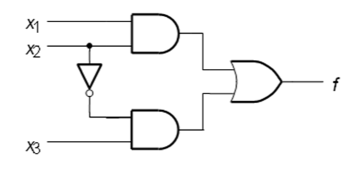
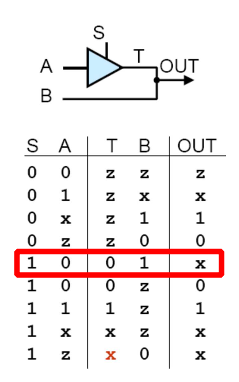
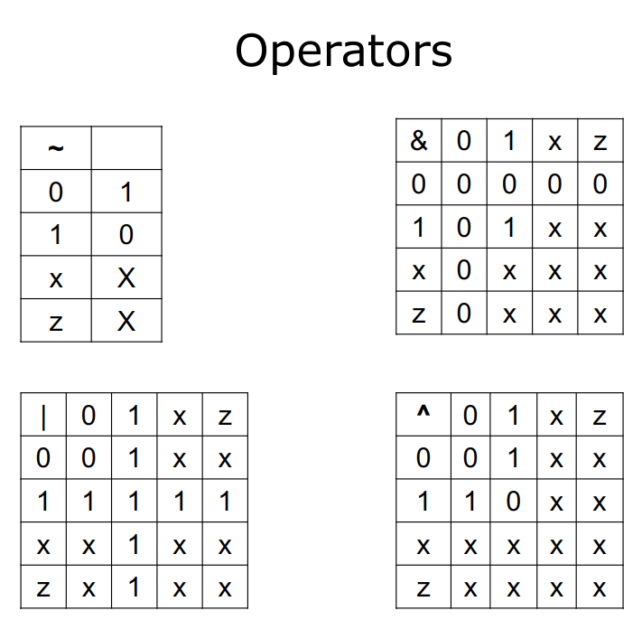

The gate instantiation statements ate concurrent.

```verilog
and(y, x1, x2)
or(y, x1, x2)
not(y, x)
```


For this circuit, here are two different way to describe the it.



```verilog
module circuit_unit(x1, x2, x3, f);
    input x1, x2, x3;
    output f;

    and(g, x1, x2)
    not(k, x2)
    and(h, k, x3)
    or(f, g, h)

endmodule
```

This is the *Structural Representation* method.


```verilog
module circuit_unit(x1, x2, x3, f);
    input x1, x2, x3;
    output f;
    
    assign f = (x1 & x2) | (~x2 & x3);
    
endmodule
```

This is the *Behavioral Representation* method. The keyword `assign` is continuous assignment. This means `f` will be updated when the assignment is changed (the right-hand side value changed).

- All the gates and assign are concurrent, which describe the structure of the circuit.  

- The procedural statement needs inside an `always` block


### Lexical Conventions

1. 0 = logic value 0.
2. 1 = logic value 1
3. z, Z, or ? = tri-state (high impedance or floating)
4. x or X= unknown or uninitialized




In the red box of the picture, because the two branch T and B of the circuit have delay, so the OUT is not definite.  

And the **Z** means there has no signal. The **X** means there has no definitive result. 

| INPUT 0 | INPUT 1 | OUTPUT |
| ------- | ------- | ------ |
| 0       | 1       | x      |
| 0       | 0       | 0      |
| 1       | 1       | 1      |
| x       | z       | x      |
|         |         |        |
| 1       | z       | 1      |
| 0       | z       | 0      |
|         |         |        |
| 1       | x       | 1      |
| 0       | x       | x      |

This table describe the relationship among 0, 1, x, z.


The numbers in the VERILOG: 

|Number|Decimal|Binary|
| ------------------- | ------- | -------- |
|4'd3|3|0011|
|8'ha|10|00001010|
|5'b111|7|00111|
|8b01011101| 93      |01011101|
|8bx1101||xxxx1101|
|10| 10| 0...01010 (32 bits)|

There are 4 format of data:

- decimal (d or D), default if no base specified!
- hexadecimal (h or H)
- octal (o or O)
- binary (b or B)

The default length is 32 bits.


### Data types

- net 

  represents interconnections between structural entities such as gates.

  The syntax: `net_type [size] net_name, net_name, ... ; `

  - `size`:  the range of [msb: lsb] 
  - `net_type`: 
    - `wire`: used to connect an output of one logic element to an input of another logic element. Examples:  `wire x;`
    - `tri`:  used for tri-state circuit nodes. Examples: `tri [7:0] DataOut;`

  

- register

  stores a value. Assignment in “always” block

  syntax: `register_type [size] variable_name, variable_name, ... ;`

  - reg:  unsigned variable of any bit size to be defined. Just a variable.

  - integer: signed 32-bit variable

    ```verilog
    reg [2:0] Count;  // 3-bit unsigned variable
    integer k; // 32-bit signed variable
    ```

- memory 

  an array of register.

  syntax: `register_type [size] memory_name[array_size];`

  ```verilog
  reg [7:0] R [3:0];        // declare 4 8-bit variables
  R[3] // access the individual variable
  R[3][7] // access the left-most bit of R[3]
  ```

  

- parameter

  defines constants.

  ```verilog
  parameter n = 32;
  ```

  

### Operator

| Operator |                                                              |
| :------: | :----------------------------------------------------------: |
|    ~     |                        1's complement                        |
|    &     |                           bit AND                            |
|    \|    |                            bit OR                            |
|    ^     |                           bit XOR                            |
|    ~^    |                           bit XNOR                           |
|    ^~    |                           bit XNOR                           |
|          |                                                              |
|    ==    |                compare logical values of 0, 1                |
|   ===    |            compare logic values of 0, 1, X and Z.            |
|          |                                                              |
|    <<    |                     Shift m left n-times                     |
|    >>    |                    Shift m right n-times                     |
|          |                                                              |
|   <<<    | Shift m left n-times, the vacant bits are filled with **0**  |
|   >>>    | Shift m right n-times, the vacant bits are filled with the **leftmost** bit (the sign bit for a signed integer). |
|          |                                                              |
|  {m, n}  |          Concatenate m to n, creating larger vector          |
|  {n{m}}  |                     Replicate m n-times                      |



All result of operation are 0, 1, x. There are no Z in it.

The logical operators are 1 bit. 


**Operator: `== and ===`**

 X compare with X is X. For example, 

```verilog
reg [3:0] a, b;
a = 4'b1100;   
b = 4'b101x;

a == 4'b1z10 // false - 0
a != 4'b100x // true - 1
b == 4'b101x // unknown - x
b != 4'b101x // unknown - x
b === 4'b101x // true - 1
b !== 4'b101x // false - 0
```

Because the x is unknown. Maybe 1 or 0. So, the result is not sure.


**Operator: `{n, m}`**

```verilog
// A= 1’b1, B = 2’b00 , C = 2’b10, D = 3’b110
Y = { B, C};  // Y is 4b’0010
Y = { A, B, C, D};  // Y is 8b’10010110
Y = { B[0], D[2], 2’b11}; // Y is 4b’0111
```

Concatenate all elements together base on the order.


**Operator: {n{m}}**

```verilog
// A = 1’b1; B = 2’b00; C = 2’b10; D = 3’b110;
Y = { 4{A} }; // Results in Y = 4’b1111
Y = { 4{A}, 2{B} }; // Results in Y = 8’b11110000
Y = { 4{A}, 2{B}, C }; // Results in Y = 10’b1111000010

```

