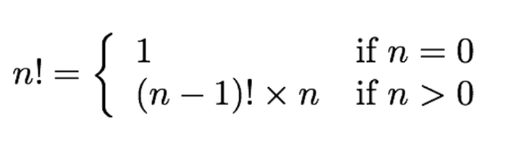
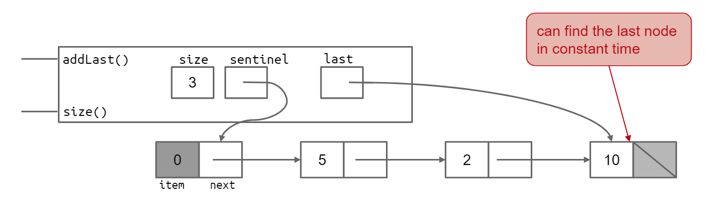

Checking

---

static checking (静态检测): 在运行之前就可以被检测出问题.

Dynamic checking (动态检测): 在runtime才能发现有问题(指针越界)

Java-doc: 

---

会有一些 assumption, 是比静态的要求更为充分的域. 

比如在参数中, n 的值就一定要 >0, 是参数所不会被检查的(静态检查没有的), 是人为规定的.

JavaDoc 3要素:

1. summary and examples: 
2. Param: 规定了一些 assumption
3. return: 如果用户按照 assumption 使用, 该函数的返回值.

method signature: 就是函数头 (或者说是函数的签名)

Specification (spec): java-doc + method signature

---

1. describes the input and output behavior of the function
2. It gives the types of the parameters and any additional constraints on them (e.g. sqrt's parameter must be nonnegative). 参数的类型与约束条件
3. It also gives the type of the return value and describes how the return value relates to the inputs. 返回值的类型与返回与输入的关系
4. specification = *method signature* + *comment* 
5. 这是一个 spec 的例子

    

7. spec 像是一个 contact 
    1. The implementeris responsible for meeting the contract,  and
    2. A client that uses the method can rely on the contract 
    3. In fact, we'll see that like real legal contracts,  specifications place demands on both parties: when the specification has a precondition, the client has responsibilities.
    4. 同时也省去了读代码的任务.
    5. decoupling, 或者说分层, 是spec带来的东西, client不用关心函数里面发生了什么, 只需要知道给什么, 做到了什么就可以了. 

8. Spec中不要出现与函数实现相关的东西.

spec structure

---

1. a precondition, indicated by the keyword requires

    if the precondition holds when the method is called, then the postcondition must holdwhen the method completes. 如果先决条件在调用方法时成立，则后置条件必须在方法完成时成立

2. a postcondition, indicated by the keyword effects

    If the precondition does not holdwhen the method is called,  the implementation is not bound by the postcondition○It is free to do anything, including not terminating, throwing an exception, returning arbitrary results, making arbitrary modifications, etc. 如果在调用方法时不满足前提条件，则实现不受后置条件的约束. 可以自由地做任何事情，包括不终止，引发异常，返回任意结果，进行任意修改等

3. Put the preconditions into @paramwhere possible

4. Put postconditions into @returnand @throws

5. ***Example:*** 

    This is the specification

    

    In Java:

    

The development of a single function proceeds in this order:

---

1. Spec: Write a specification for the function
2. Test: Write tests that exercise the specification
3. Implement: Write the actual code. Once your code passes the tests you wrote,  you're done

Fail Fast

---

快速失败, 意思是把不符合要求的input快速结束程序.

Partition in test: 分区测试

---

这个在软工里面也出现过

recursion

----

递归, 这个没什么可以记录的, 就只能多写.

按照公式来想的话好理解很多

1. base condition: 收尾条件. 满足收尾条件的时候就让程序结束.
2. transfer function: 从这一状态转移到下一状态的 transfer function.

Black-box vs White-box Testing

---

Black-box testing

1. choosing test cases only from the specification, not the implementation of the method
2. We partitioned and looked for corner cases/boundaries without looking at the actual code for these methods.
3. 不需要看方法的实现, 把implement当作黑盒来进行input/output测试

White-box testing(also called glass box testing)

1. choosing test cases with knowledge of how the method is actually implemented
2. For example, if the implementation selects different algorithms depending on the input,  then you should partition according to those domains
3. Another example, if you know that the implementation keeps an internal cache that remembers the answers to previous inputs,  then you should test repeated inputs.
4. White-box Testing Test Cases:
    1. spec 不做要求的就不用测试, spec是前置条件
    2. 不需要实现spec中没有要求的部分
    3. 是什么意思? 

5. but it's important to note that even glass box tests must followthe specification. test cases must obey the contract,  just like every other client. 即使是test也必须遵守contact, 不检测contact之外的东西.

Statement coverage:  

---

1. Statement coverage is every statement run by some test case? 
2. Branch coverage:  for every if or while statement in the program, are both the true and the false direction taken by some test case?
3. Path coverage:  is every possible combination of branches —every path through the program —taken by some test case?

Unit Testing and Stub

---

For example,  a stub for `getWebPage()` wouldn't access the internet at all,  but instead would return mock web page content no matter what URL was passed to it

用于构建大系统的时候, 先返回一个虚拟的对象. 先用于下文. 

A stub for a class is often called a mock object

Regression Testing 回归测试

---

***Definition:*** Running all your tests after every change is called regression testing. 在每次改动之后都从新进行所有测试.

rerun your tests when you modify your code

以免在重新修复bug或者添加特性的时候出现问题.

Java Visualizer

---

一个插件, vscode 没有呜呜...

List

---

一个标准的 List 的模样:

一个双向列表

### Exception

----

As a general rule,  you'll want to use checked exceptionsto signal special resultsand unchecked exceptionsto signal bugs

大概分成两类:

#### Checked Exception

---

作用: 用来传递特殊值. signal special results

标识: 需要在函数头做标识

继承: `Exception`

> 这个 *checked* 的意思我的理解是: 
>
> 需要程序员自己check

#### Unchecked Exception

---

作用: 传递bugs, signal bugs.

标识: 不要在函数头做标识

继承: `RuntimeException`

Errors should be considered unrecoverable, and should notbe caught by your code

> 不用程序员自己check, 程序负责check

