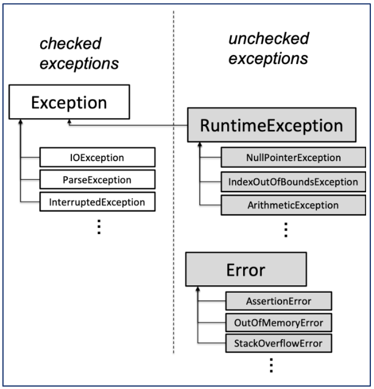

大概分成两类:

#### Checked Exception

作用: 用来传递特殊值. signal special results

标识: 需要在函数头做标识

继承: `Exception`

#### Unchecked Exception

作用: 传递bugs, signal bugs.

标识: 不要在函数头做标识

继承: `RuntimeException`

Errors should be considered unrecoverable, and should notbe caught by your code

