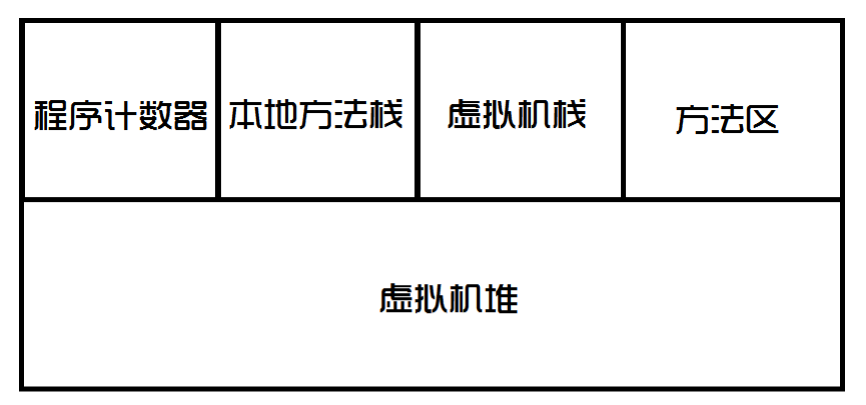

# Java 虚拟机

虚拟内存分布:

1. 程序计数器: 是JVM执行程序的流水线.
2. 本地方法栈 (Native Method Stack): 执行系统的指令, 调用操作系统方法所使用的栈. 
3. 虚拟机栈: JVM 执行 Java 代码所使用的栈
4. 方法区: 存放了一些常量, 静态变量, 类信息, 可以理解成class 文件在内存中存放的位置.
5. 虚拟机堆: 是 JVM 执行 Java 代码所使用的堆.

