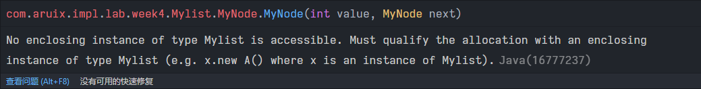

# Java 内部类

一个简单的内部类:

```java
public class Mylist {
    public int size;
    public int modCount;

    public class MyNode {
        public int value;
        public MyNode next;

        public MyNode(int value, MyNode next) {
            this.next = next;
            this.value = value;
            size++;
        }
    }
}
```


但是会在实例化的时候出点问题,

```java
public static void main(String[] args) {
    Mylist l = new Mylist();
    MyNode n2 = new MyNode(2, null);
    MyNode n1 = new MyNode(1, n2);
}
```

第三行和第四行就会报错:



意思我没看懂... 但是给出了解决方法:

1. 要用外部类的实例创建出内部类的实例.

    ```java
    public static void main(String[] args) {
        Mylist l = new Mylist();
        MyNode n2 = l.new MyNode(2, null);
        MyNode n1 = l.new MyNode(1, n2);
    }
    ```

    

2. 把内部类变成`static`

    ```java
    public class Mylist {
        public int size;
        public int modCount;
    
        public static class MyNode {
            public int value;
            public MyNode next;
    
            public MyNode(int value, MyNode next) {
                this.next = next;
                this.value = value;
                size++;
            }
        }
    }
    ```

    