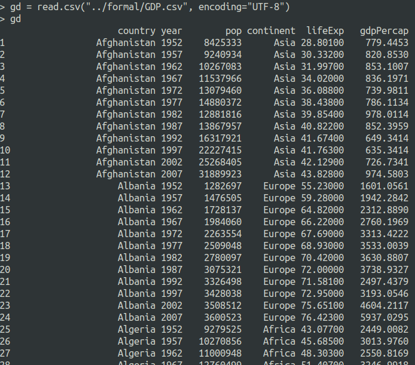
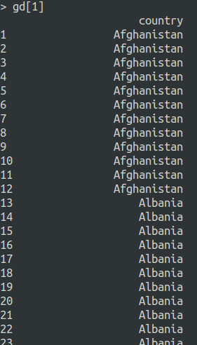
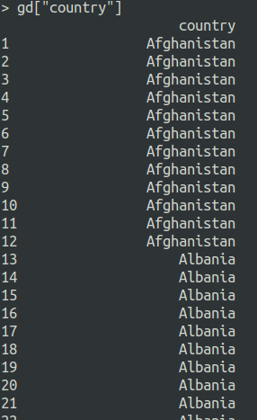
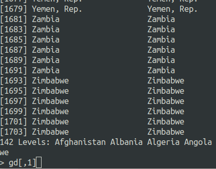
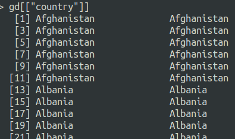
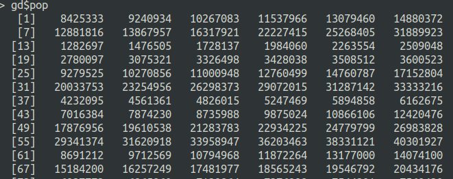

# R


[toc]

## Data struct


1. Number:

   1. Common type: 

      `123 - 0.125`, which means *R* is weak type language.

   2. Scientific notation:

      `1.23e2 - 1.25e-1`.

2. String

   `""` or `''` is same.

   ```R
   // transfer to large case
   toupper()
   
   // transfer to low case 
   tolower()
   
   // count length for string
   nchar()
   
   // String to number
   as.numeric()
   
   // number to String
   as.charactre()
   
   // split
   strsplit()
   
   // replace String 
   gsub()
   ```

   

3. Boolean

   `TRUE`, `FALSE`

4. Vector

   `c()`, *vector* is as same as *list* or *array* in *Java* or *Cpp*. This function can generate vector.

   

5. Matrix

   Two dimension array.

   ```R
   > vector = c(1,2,3,4,5,6)
   > m = matrix(vector, 2, 3)
   
        [,1] [,2] [,3]
   [1,]    1    3    5
   [2,]    2    4    6
   
   // change col / change row
   > colnames(m) = c("col_name1", "col_name2", "col_name3")
   > rownames(m) = c("row_name1", "row_name2", "row_name3")
   
   ```

6. Data frame:

   Data representation form. Data in *data frame* is vertical. Such as:

   ```R
   	col_name1	col_name2	col_name2
   1	data		data		data
   2	data		data		data
   3	data		data		data
   4	data		data		data
   5	data		data		data
   ```

   **Constructor**:

   ```R
   # Syntax:
   #
   # data.frame(…, row.names = NULL, check.rows = FALSE,
   #           check.names = TRUE, fix.empty.names = TRUE,
   #           stringsAsFactors = default.stringsAsFactors())
   
   gdp_country <- data.frame(
       "Country" = unique(gd[['country']]),
       "Mean_gdp" = mean_gdp)
   
   # the column name is Country and Mean_gdp
   ```

   It ~~like~~ **is** a *table* to process data.

   It is a feature that only R has. It can read a *csv* directly transfer to data frame.

   ```R
   gd = read.csv("./GDP.csv", encoding="UTF-8")
   ```

   

   

   **Access**:

   There are 3 form to access data frame:

   The example data frame:

   

   

   1. `[]`

      return the sub-data-frame of the data frame. To another word, return the subset of data frame.

      `data_frame[index]`

      

      `data_frame["col_name"]`
   
      
   
      `data_frame[,1]`: access the number of column.
   
      
   
      
   
   2. `[[]]`
   
      return the vector. The atomic vector.
   
      
   
      
   
      
   
   3. `$`
   
      same as `[[]]`, also return the vector.
      
      
   
   > Data frame is a list. the `[]` return the sublist.
   
   


## Operations

This section describe the operations and operators in *R*

1. Assignment: `<-`, `=` is also acceptable.
2. Matrix: `%*%`, 用于矩阵与它转置的矩阵相乘.
3. contains: `%in%`, judge element contains array.
4. generatr numbers: `:`, generate a series of numbers vectors.


### Comparition Numeric values [1]

For floats:

`==` cannot be used to compare two floats, because the precision of float. It cannot get correct answer. So, use 'near equality' in floats. The *tolerance* of comparition is `1.5e-8`.

```R
x <- c(4.00000005, 4.00000008)
y <- c(4.00000002, 4.00000006)

all.equal(x, y)
## [1] TRUE
```

If the difference is greater than the tolerance level the function will return the mean relative difference:

```R
x <- c(4.005, 4.0008)
y <- c(4.002, 4.0006)

all.equal(x, y)
## [1] "Mean relative difference: 0.0003997102"
```


For vectors:

To compare each elements in vector:

```R
x <- c(1, 4, 9, 12)
y <- c(4, 4, 9, 13)

x == y
## [1] FALSE  TRUE  TRUE FALSE
```

To test if two objects are exactly equal:

```R
x <- c(4, 4, 9, 12)
y <- c(4, 4, 9, 13)

identical(x, y)
## [1] FALSE

x <- c(4, 4, 9, 12)
y <- c(4, 4, 9, 12)

identical(x, y)
## [1] TRUE
```


## Function

Define a function:

```R
function_name <- function(arg_1, arg_2, arg_3){
    return ()
}
```


factor:

```R


```


Build-in functions:

```R

// 
seq(start_num, end_num, step)

// calculate 2 avarage number of numbers
mean(a, b)

// 
sum()

//
max()

//
min()

//
range()

//
sd()

//
var()

// repeat
rep()

// like grep
which()

// check vector is all TRUE
all()

// check vector has TRUE
any()

// merge two data structure
merge()
```


Math functions:

```R
// 
sqrt()

// The natural constant e to the nth power,
exp()

// calculate log
log()

// Round up n
ceiling()

// Round down n
floor()

// \pi
pi

// natural distrubtion
norm()
```


Matrix function:

```R
// Transpose
t()
```


Features of function in *R*, the lazy calculation, which is like *python*. If you don't reach that error line of code, the error will not camplain.


## Loop and Judgement

1. if else syntax

   As same as *Java*

   ```R
   if(boolean_expression 1) {
       // 如果布尔表达式 boolean_expression 1 为真将执行的语句
   } else if( boolean_expression 2) {
       // 如果布尔表达式 boolean_expression 2 为真将执行的语句
   } else if( boolean_expression 3) {
       // 如果布尔表达式 boolean_expression 3 为真将执行的语句
   } else {
       // 以上所有的布尔表达式都为 false 时执行
   }
   ```

2. switch syntax

   It is far away from *Java*

   ```R
   // Syntax switch(expression, case1, case2, case3....)
   x <- switch(
      3,
      "google",
      "runoob",
      "taobao",
      "weibo"
   )
   print(x)
   ```

   

3. repeat 

   ```R
   repeat { 
       // control break
       if(condition) {
          break
       }
   }
   ```

4. while

   ```R
   while(condition)
   {
      statement(s);
   }
   ```

5. for

   ```R
   for (value in vector) {
       statements
   }
   
   v <- LETTERS[1:4]
   for ( i in v) {
      print(i)
   }
   
   // output
   [1] "A"
   [1] "B"
   [1] "C"
   [1] "D"
   ```

   

`break`: jump out of this loop. As same as the `break`.

`next`: stop this circle, and start next loop. As same as the `continue`.


## Commonly Used Packages

csv

```R
data <- read.csv("filename.csv", encoding="UTF-8")

// number of column.
ncol(data)
// number of row.
nrow(data)

// get subset of a set. Like a arrow function and get value.
subset(data, likes > 1 & name == "Runoob")

// write into csv file.
write.csv()
```


## Experience for me

I think the difference between *R* and *Python* is the *OOP*. The *R* emphasizes the **Natural language to Math programing**. But the **Natural language** break the harmony between programing and natural language. 

The globle functions are too many. Loose the hierarchy of origanization. 


Reference:

[1] http://uc-r.github.io/comparing_numeric_values/