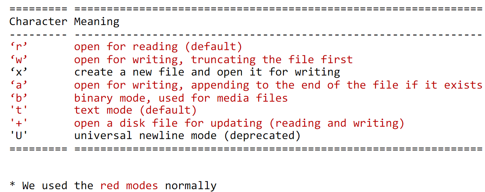

# python

[toc]

python 的数据结构我尝试记过好多次, 但是都很容易忘记(可能就是屠龙术带来的影响)

> 屠龙术: 很厉害的技术, 但是根本用不上. 就没有什么意义.

## lab 1

- Number

  乘方: x \*\* 2

  - Integer

  - Float

- Boolean

- String

- List

  列表的数据项不需要具有相同的类型, 是一种可变的数据类型

  ```python
  list1 = ['physics', 'chemistry', 1997, 2000]
  ```

- Tuple

  多种数据结构的列表, 和列表相比, 元组不可变.

  返回多个值的时候使用, 解构比较方便. 因为任意无符号对象, 以逗号隔开, 默认为元组.

  ```python

  ## 构造

  tup1 = ()
  # 只有一个元素的时候要加上逗号, 不然就是一个数和一个括号了.
  tup2 = (50,)
  tup3 = ('physics', 'chemistry', 1997, 2000)
  # 自动解构
  tup4 = (1,2)
  x,y = tup4

  ## 访问

  print "tup1[0]: ", tup1[0]
  # 前闭后开, 在后边界上的元素是不算的, 前边界上的元素是算的.
  print "tup2[1:5]: ", tup2[1:5]
  # contains
  3 in (1, 2, 3) # True
  # 反向读取
  tup[-2] # 倒数第二个元素
  tup[1:] # 截取元素 slice
  tup[-3:]

  ## 修改

  # 元组不让修改, 但是可以拼接:
  tup1 = tup2 + tup3

  ## 删除

  del tup
  ```

  元组的内置成员函数

  ```python

  # 比较两个元组元素。
  cmp(tuple1, tuple2)
  # 计算元组元素个数。
  len(tuple)
  # 返回元组中元素最大值。
  max(tuple)
  # 返回元组中元素最小值。
  min(tuple)
  # 将列表转换为元组
  tuple(seq)

  ```

- Dict

  键值对(json)

全局变量: global

## lab2

### 全局变量与局部变量

python 的全局变量和局部变量搞得我难受.

1. 函数内部的变量名如果第一次出现，且出现在 `=` 前面，即被视为定义一个局部变量，不管全局域中有没有用到该变量名，函数中使用的将是局部变量
2. 只要是使用变量，而该变量在全局域中有定义，而在局部没有定义，则会使用全局变量。
3. 如果使用的变量在全局域中有定义，在局部域中也有定义，则默认会使用局部变量。
4. 如果要在函数中给全局变量赋值，需要用 global 关键字声明。

> 优先局部变量, 要是修改全局变量一定要有 global

### File open modes



## Lab3

socket programming: 就是一种在互联网中连接两端点的方法, 一个 socket 在一个 IP 地址上监听一个端口, 别的 socket 与他建立连接.

###
