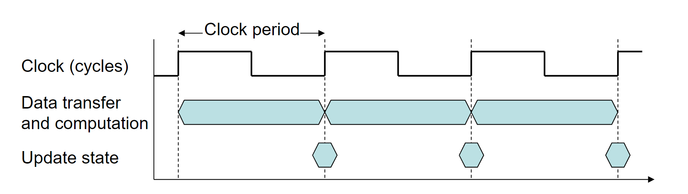

Performance：
$$
\text{Performance} = \frac{1}{\text{Execution Time}}
$$

Measuring Execution Time:

总共有两种办法衡量执行时间，

1. Elapsed time

   总共的相应时间，包括cpu时间和IO时间，用于衡量整个系统的性能。

2. CPU time

   只计算一项任务的时间，不包括IO时间和别的任务的时间。包括用户的CPU时间和系统的CPU时间。

   

CPU clock：

1. Clock period: duration of a clock cycle. 一个cc的时间长度。
2. Clock rate: cycles per second. cc在一秒钟的个数

CPU time：

CPU Time = CPU Clock X Clock Time

减少cpu的clock个数，提升cpu clock rate，都能让效率提升。

clock cycles就是clock过了几圈。

Instruction Count and CPI：

clock cycles = Instruction count * cycles per instruction 

执行每一个指令都是需要时长的，每一个指令所需要的时长都不一样，所以有平均时长的定义。

Average cycles per instruction (CPI) ：指令平均CPU clock个数

