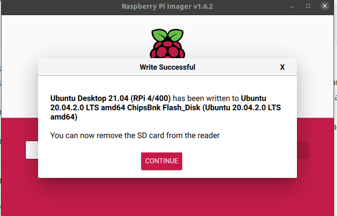

## apt backup

这东西我觉得出奇的重要, 因为我真的不想在不同的设备上再装一次所有软件, 真的会疯掉的, 还有各种软件的配置,

1. 备份apt的所有安装包,
2. 备份所有软件的设置文档, 最好是写一个程序能够直接添加路径的, 放到syncthing的备份文件夹里.


这个东西叫做`apt-clone`, 


```bash
$ sudo apt-clone clone /backup
```

## hdmi 分辨率

我觉得和我查吗m2的usb槽有关系, 因为这东西可能会导致屏幕的供电不足, 除此之外我再也找不到别的理由了.

1. 可以在`raspi-config`里面进行分辨率的设置, 要是桌面直接设置没的话. 我就是在这个里面设置好的.

2. 还有一个启动时的设置, 叫做`/boot/config.txt`, 里面也是有相关的设置的.

## 风扇设置

通过GPIO进行设置, 明天我再看一看.

## syncthing

这是非常好用的东西, 真正的实现了同步这种功能, 并且开源(意味着安全性与可用性得到了保障)

这就是分布式的力量吗!

## 端口号查询

`netstat -tunlp |grep 端口号`: 

用于查看指定的端口号的进程情况，如查看8000端口的情况，`netstat -tunlp |grep 8000`


## Raspberry pi imager

location: `~/.cache/Raspberry Pi/Imager`



This is a Ubuntu desktop version screen shot.

Okay, by using the *raspberry pi imager*, it can automatically completely installed.

