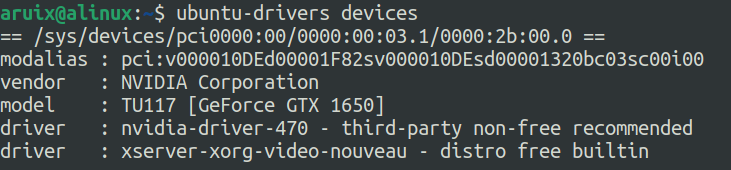
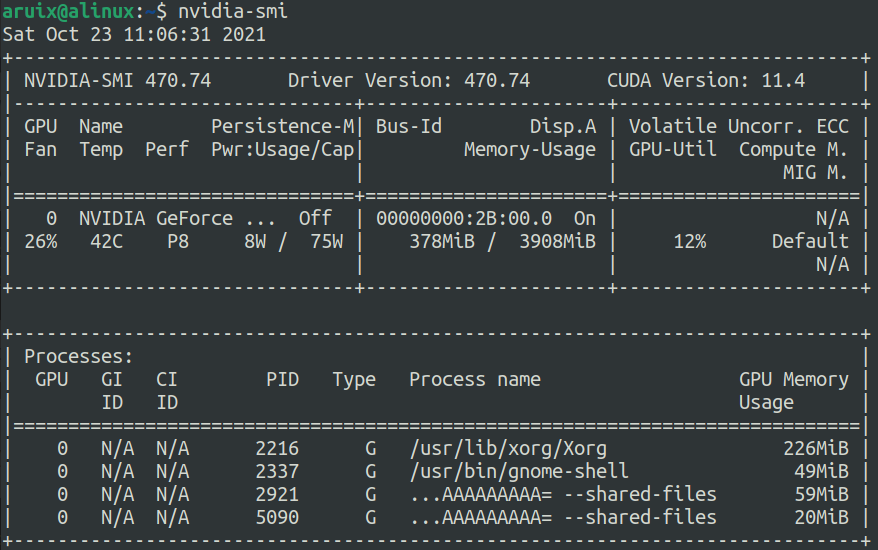

# 装驱动

是一个永远逃不过的并且很重要的话题，并且资料查的不对的话，怎么做都不对。


ubuntu是预装了Nouveau这个开源的nvidia driver。但是肯定不如nvidia自己的东西。cuda什么的肯定是没有的。


```bash
ubuntu-drivers devices
```

找到这个显卡自己支持的所有驱动。



安装recommended版本：

```bash
sudo ubuntu-drivers autoinstall
```

在安装完成之后，重启。

```bash
nvidia-smi
```

查看显卡的控制面板。




这一切看起来都很美好，但是会出现一种问题，在输入`ubuntu-drivers devices`的时候就没有输出。也就是说在对应的apt源里就没有这些的驱动信息。

所以要使用ppa添加一下仓库。

```bash
sudo apt install software-properties-common
sudo add-apt-repository ppa:graphics-drivers/ppa -y
sudo apt update
ubuntu-drivers devices
```

这样就更新完成了。

```bash
sudo ubuntu-drivers autoinstall
```

自动安装推荐版

活着手动安装对应版本：

```bash
sudo apt install nvidia-driver-470
```


