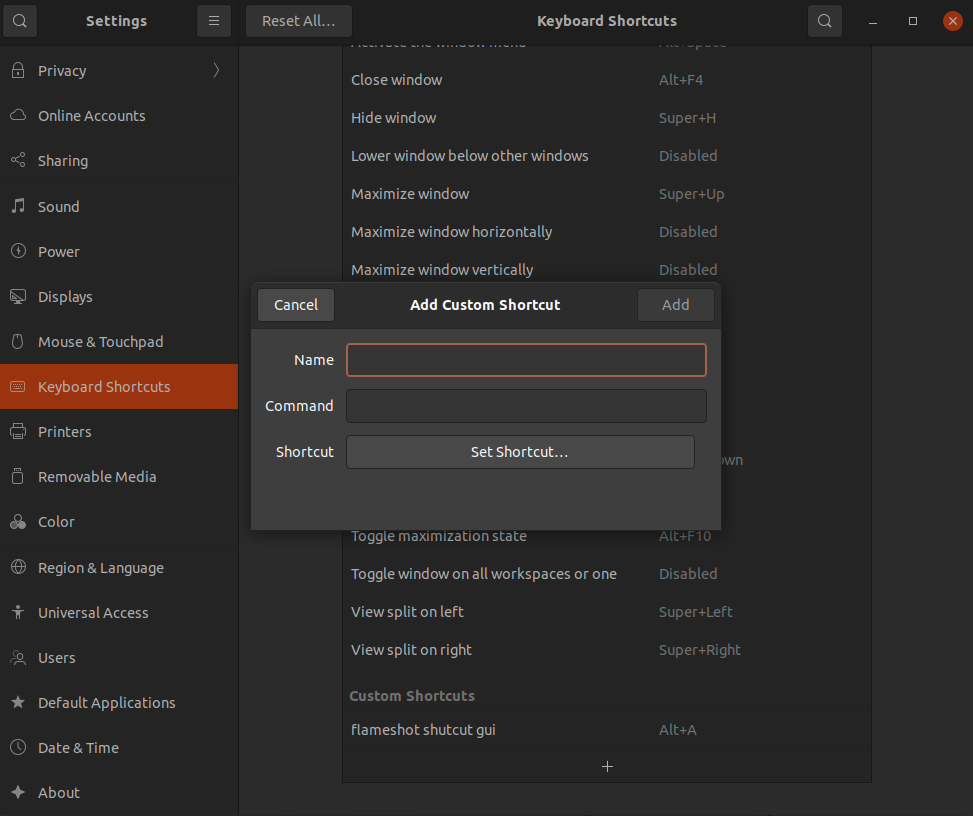
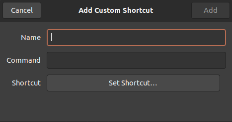
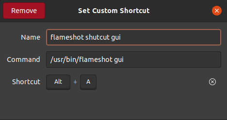

# Customize the shortcut in ubuntu 

In settings, there could *add custom shortcut*.

command is the *command* in terminal. Which means, press the combine buttons, the command will be effected. 

For example, the `flameshot` shortcut could be:

Then the combine buttons will be active. 