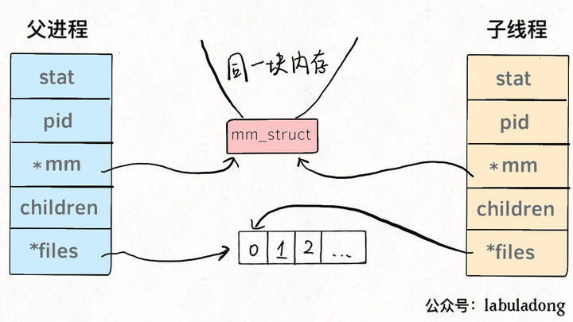
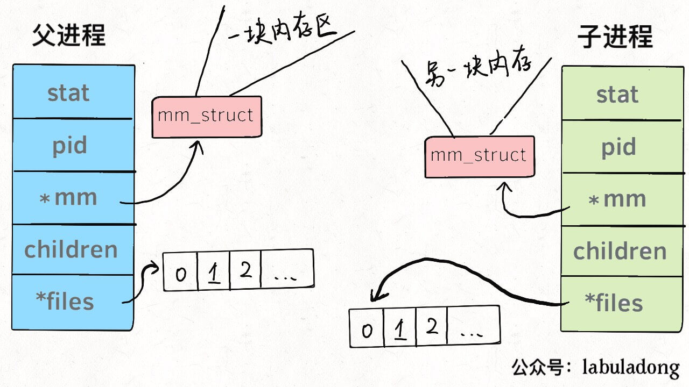

# Linux中的线程与进程

系统调用`fork()`是新建一个子进程, `pthread()`可以新建一个线程. 

> 系统调用: 指运行在用户空间的程序向操作系统内核请求需要更高权限运行的服务。系统调用提供用户程序与操作系统之间的接口。大多数系统交互式操作需求在内核态运行。如设备IO操作或者进程间通信

但是线程和进程都是用`task_struct`来表示的, 唯一的区别就是内存的共享方式不同.

也就是说, 子线程使用的是父进程的内存空间与文件描述符数组. 子进程使用的内存和数组和父进程分离开了.

(并且线程也是有pid的, linux 只是把线程当作共享内存的进程来对待了)

在linux中, 新建线程与进程都是一样快的, 因为linux采用了copy on write的优化策略. 

> copy on write: 写入时复制. 在程序需要复制内存区域的时候, 不会立即复制, 而是返回当前区域的指针, 在这个复制的区域发生改变(写入)的时候才会再去复制.