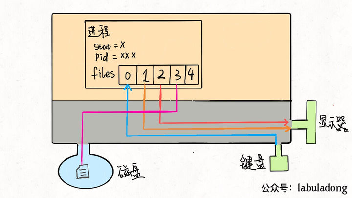

# 文件描述符

linux 中进程的数据结构 (进程描述符):

```c
struct task_struct {
    // 进程状态
    long              state;
    // 虚拟内存结构体
    struct mm_struct  *mm;
    // 进程号
    pid_t             pid;
    // 指向父进程的指针
    struct task_struct __rcu  *parent;
    // 子进程列表
    struct list_head        children;
    // 存放文件系统信息的指针
    struct fs_struct        *fs;
    // 一个数组，包含该进程所有打开的文件指针(linux中, 一切都是文件, 换句话说, 是所有该进程占用的资源)
    struct files_struct     *files;
};
```


`*files`是一个数组的指针, 数组里面装的是文件描述符(系统分配的打开的文件的指针). 这个是进程级的文件描述表.

进程通过文件描述符来访问相应的资源.

所有的进程, 这个数组的前三位是 `[stdIn, stdOut, stderr]`.

进程都从`files[0]`中读取输入, 从`files[1]`输出, 向`files[2]`中写入错误信息. 当别的文件被打开的时候, 它会被放到这个数组的后面.





### 重定向

当进程想读取数据的时候都默认会从`files[0]`中读取, 把`files[0]`指向一个文件的话, 进程就会从这个文件中读取数据. 输出也是一样的道理.

```shell
# 输出重定向
$ command > file.txt

# 输入重定向
$ command < file.txt
```


### 管道

把一个进程的输出当作一个进程的输入, 像是在进程的IO中架起了管道, 数据就在这个管道中流动.

```shell
$ cmd1 | cmd2 | cmd3
```


### Appendix

1. 文件描述符与文件句柄不是一个东西
2. 


reference:

https://zhuanlan.zhihu.com/p/105086274


